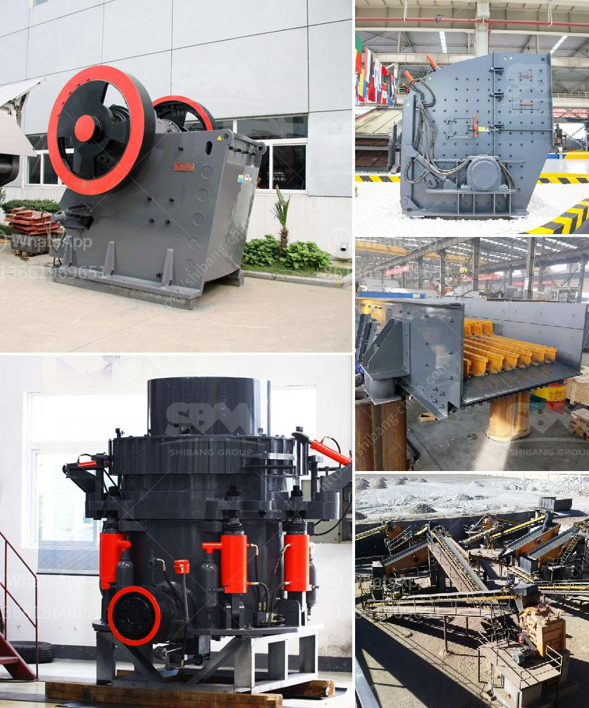

<h3>processing of cement</h3>
The process of manufacturing cement is a complex and energy-intensive one. It involves several steps, each with its own set of challenges and requirements. Here, we will discuss the primary processes involved in cement production.

The first step in cement manufacturing is quarrying raw materials, such as limestone, clay, shale, iron ore, and silica. These materials are then crushed into smaller pieces and transported to the plant. Once at the plant, the raw materials go through further crushing, blending, and grinding processes to achieve the desired chemical composition for cement production.

Next, the raw materials are heated in a kiln at extremely high temperatures (over 1400 degrees Celsius) to form clinker. Clinker is a solid material that results from the chemical transformation of the raw materials. This process, known as calcination, requires a significant amount of heat and energy.

After cooling, the clinker is ground into a fine powder with the addition of a small amount of gypsum, which acts as a setting regulator. This final product is known as Portland cement, the most commonly used type of cement in construction.

The production of cement has significant environmental impacts. The kiln's high temperature and the combustion of fuels, such as coal or natural gas, generate large amounts of greenhouse gases, including carbon dioxide. Additionally, quarrying raw materials can lead to deforestation, habitat destruction, and landscape alteration.

Efforts have been made to minimize the environmental footprint of cement processing. Many plants are adopting more energy-efficient technologies, such as the use of alternative fuels and raw materials. These include industrial waste products like recycled tires, biomass, or even municipal solid waste.

In conclusion, the production of cement is a complex and energy-intensive process involving several stages. While the demand for cement is constantly increasing due to urbanization and infrastructure development, it is crucial to strive for more sustainable and environmentally friendly methods of cement production.
<h3>Contact us</h3><ul><li><strong>Whatsapp:&nbsp;<a href="https://wa.me/8613661969651">+8613661969651</a></strong></li><li><a href="https://swt.shibang-china.com/?git&amp;zhl&amp;processing of cement"><strong>Online Service(chat now)</strong></a></li></ul><h3>Related</h3><ul><li><a href='portable stone crushers uganda for sale.md'>portable stone crushers uganda for sale</a></li><li><a href='vertical mill ball compsition.md'>vertical mill ball compsition</a></li><li><a href='crusher machine in china.md'>crusher machine in china</a></li><li><a href='used ball mill in gujrat.md'>used ball mill in gujrat</a></li><li><a href='limestone quarry operations.md'>limestone quarry operations</a></li></ul>