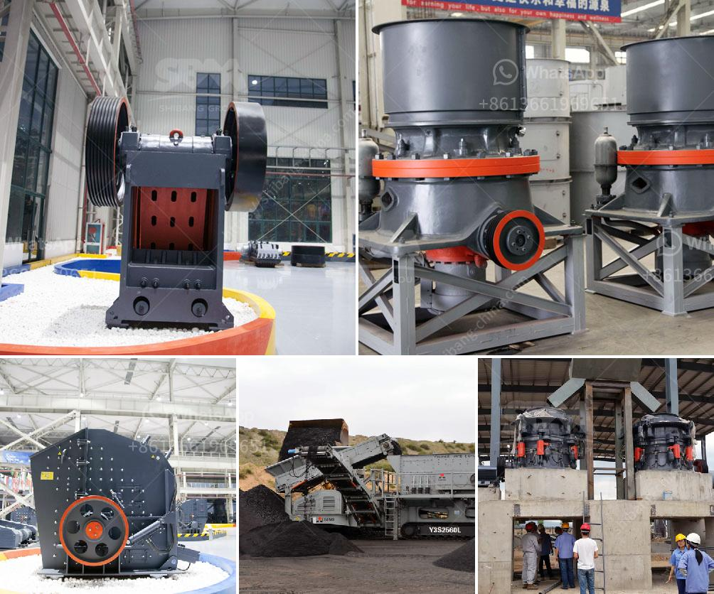

<h3>production of calcium carbonate from limestone</h3>
Calcium carbonate, commonly known as limestone, is a mineral that has many uses in various industries. The production of calcium carbonate involves crushing limestone to a fine powder, followed by purification through a series of processes.

The first stage of production involves crushing the limestone to a small size. This is done by using a jaw crusher, which breaks the big-sized limestone into smaller pieces. Next, the crushed limestone is subjected to a vibrating screen to separate different sizes of calcium carbonate particles.

After the initial crushing process, the limestone powder goes through further purification. One of the widely used methods is called the carbonation process. In this process, the crushed limestone is fed into a reactor along with water and carbon dioxide gas. The reaction between calcium carbonate and carbon dioxide produces calcium bicarbonate, which is soluble in water.

The calcium bicarbonate solution is then subjected to a heating process to remove excess water and carbon dioxide. The result is calcium carbonate in the form of a powder. This powder is then packaged and sold for various industrial applications.

The production of calcium carbonate from limestone is an important process that provides a wide range of applications for various industries. The purification process involves crushing the limestone and using a chemical reaction to produce pure calcium carbonate, which is then used in various applications such as construction, agriculture, plastics, and more.

In conclusion, the production of calcium carbonate from limestone involves crushing the limestone to a fine powder and then purifying it through various chemical processes. This versatile mineral is used in a multitude of industries, making it an essential component in various products and applications.
<h3>Contact us</h3><ul><li><strong>Whatsapp:&nbsp;<a href="https://wa.me/8613661969651">+8613661969651</a></strong></li><li><a href="https://swt.shibang-china.com/?git&amp;zhl&amp;production of calcium carbonate from limestone"><strong>Online Service(chat now)</strong></a></li></ul><h3>Related</h3><ul><li><a href='cone crusher manufacturers china.md'>cone crusher manufacturers china</a></li><li><a href='conveyor belts in coacalco de berriozabal.md'>conveyor belts in coacalco de berriozabal</a></li><li><a href='quartz powder manufacturing process.md'>quartz powder manufacturing process</a></li><li><a href='gypsum crusher in salalah oman.md'>gypsum crusher in salalah oman</a></li><li><a href='coltan processing plant prices.md'>coltan processing plant prices</a></li></ul>