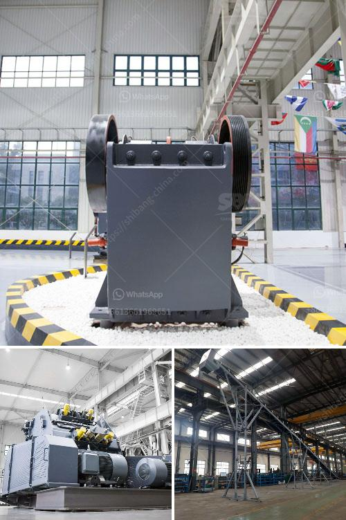

<h3>production of rock sand</h3>
The production of rock sand is an environmentally friendly alternative to traditional sand extraction methods. This innovative process involves crushing rocks into smaller, uniformly-sized particles to create a sand-like material that can be used in various construction projects.

One of the major advantages of rock sand production is that it eliminates the need for riverbed excavation or dredging. Traditional sand extraction methods often involve extracting sand from riverbeds, which can disrupt the natural ecosystem and cause erosion. In contrast, crushing rocks to produce sand is a sustainable and eco-friendly approach that minimizes environmental damage.

The process starts with the selection of suitable rocks, which are then crushed using specialized machinery. The resulting rock sand particles are washed and screened to ensure their quality and consistency. This process allows for the production of sand with specific properties and gradations that are suitable for different purposes, such as concrete production or road construction.

Rock sand has several advantages over natural sand. Its particles are angular, which enhances the interlocking properties, making it ideal for use in concrete mixes. Additionally, rock sand may contain fewer impurities compared to natural sand, resulting in stronger and more durable construction materials.

Furthermore, the production of rock sand reduces the reliance on river sand, which is becoming increasingly scarce due to unsustainable extraction practices. By utilizing crushed rocks, we can tap into an abundant resource and reduce the strain on natural sand reserves.

In conclusion, the production of rock sand offers a sustainable and environmentally friendly alternative to traditional sand extraction methods. This innovative process not only helps preserve our natural ecosystems but also provides a reliable source of high-quality construction materials. By embracing rock sand production, we can build a more sustainable future for the construction industry.
<h3>Contact us</h3><ul><li><strong>Whatsapp:&nbsp;<a href="https://wa.me/8613661969651">+8613661969651</a></strong></li><li><a href="https://swt.shibang-china.com/?git&amp;zhl&amp;production of rock sand"><strong>Online Service(chat now)</strong></a></li></ul><h3>Related</h3><ul><li><a href='production of rock sand.md'>production of rock sand</a></li><li><a href='quarry crusher machinery for sale.md'>quarry crusher machinery for sale</a></li><li><a href='200 mesh ore grinder cost.md'>200 mesh ore grinder cost</a></li><li><a href='150 tpd cement line price.md'>150 tpd cement line price</a></li><li><a href='portable rock crusher machine for sale kenya.md'>portable rock crusher machine for sale kenya</a></li></ul>