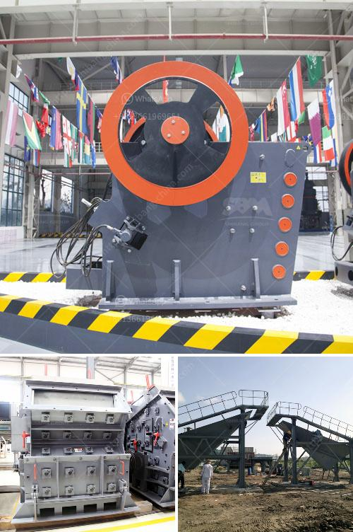

<h3>produsen mesin ultra fine grinding</h3>
In the ever-evolving world of industrial processing, there is a constant demand for machines that can deliver the highest levels of precision and fineness. This is where produsen mesin ultra fine grinding comes into play. With their cutting-edge technology and innovative designs, these manufacturers specialize in producing machines that are capable of grinding materials down to extremely fine particle sizes.

One of the key advantages of produsen mesin ultra fine grinding is their ability to produce a high-quality end product. These machines are designed to grind even the most challenging materials, such as minerals, ores, and chemicals, into fine powders. By utilizing advanced grinding mechanisms, the machines can achieve particle sizes ranging from a few microns to sub-micron levels, offering an unprecedented level of precision.

Another notable feature of produsen mesin ultra fine grinding machines is their versatility. These machines are capable of grinding a wide range of materials, including soft, hard, and brittle substances. Whether it's grinding materials for the pharmaceutical, chemical, or food industries, these machines can handle it all. Their versatility allows for greater flexibility in production processes, making them an invaluable asset for various industries.

Produsen mesin ultra fine grinding machines are also known for their energy efficiency. With efficient grinding mechanisms and low energy consumption, these machines offer sustainable and eco-friendly processes. By minimizing energy wastage and optimizing the grinding process, these machines effectively reduce operating costs and environmental impact.

Furthermore, produsen mesin ultra fine grinding manufacturers continuously invest in research and development to improve their machines. They strive to push the boundaries of technology and innovation to meet the ever-increasing demands of the industry. This commitment to continuous improvement ensures that customers have access to the latest advancements, resulting in improved performance and productivity.

In conclusion, produsen mesin ultra fine grinding has revolutionized the industrial grinding sector by delivering machines that offer precision, versatility, energy efficiency, and continuous improvement. These machines have become indispensable in various industries for their ability to produce fine powders with unparalleled precision. As the industry evolves, produsen mesin ultra fine grinding manufacturers will continue to play a crucial role in shaping the future of industrial processing.
<h3>Contact us</h3><ul><li><strong>Whatsapp:&nbsp;<a href="https://wa.me/8613661969651">+8613661969651</a></strong></li><li><a href="https://swt.shibang-china.com/?git&amp;zhl&amp;produsen mesin ultra fine grinding"><strong>Online Service(chat now)</strong></a></li></ul><h3>Related</h3><ul><li><a href='grinding mill machine kenya.md'>grinding mill machine kenya</a></li><li><a href='plant crushing materials in antioquia.md'>plant crushing materials in antioquia</a></li><li><a href='stone conveyor belt design manual pdf.md'>stone conveyor belt design manual pdf</a></li><li><a href='small rock crusher for small scale aggregate producers.md'>small rock crusher for small scale aggregate producers</a></li><li><a href='conveyor belt manufacturing plant crushers equipment.md'>conveyor belt manufacturing plant crushers equipment</a></li></ul>