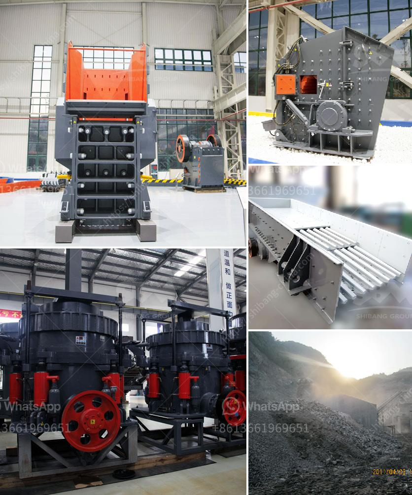

<h3>project proposal on stone crushing mill small scale</h3>
Stone crushing mills use machinery to crush large stones into stone chips, which are then used as building or road construction materials. According to an article in Dhaka Tribune [1], most of these factories in the north and north-eastern regions of Bangladesh usually import stones from neighbouring countries such as India and Bhutan. The size of the stone chips ranged from 3/4 to 5/8 inch.

Unfortunately, all of these stone crushing mills are not licensed, and hence, the overall functioning and output of the industry in these regions is largely unknown. However, one can certainly imagine the extensive environmental damage that can occur due to the unregulated nature of these stone crushing mills.

Therefore, it is important to initiate a project proposal to better regulate the stone crushing mills in these regions of Bangladesh. The project would aim to improve employment opportunities for the poor, provide safe working conditions with decent wages and reduce air and environmental pollution.

The project is intended to develop a new methodological framework for training and support for small-scale stone crushing mills in the north-eastern region. This will help to gain a deeper understanding of the operations of the industry, identify major critical areas that need intervention, and propose suitable strategies that can mitigate the negative impacts while promoting sustainable development in the area.

Additionally, the project proposal will assess the positive socio-economic impacts of formalizing the stone crushing mills industry on poverty reduction and empowering vulnerable communities in the region. The proposal will further explore potential funding sources for implementing programs that will address the identified areas for intervention.

1. Identification and mapping of stone crushing mills in the region: The proposal will provide a list of stone crushing mills installed in the region along with their operational status and production capacity.

2. Environmental assessment: A comprehensive environmental impact assessment will be conducted, focusing on air quality, noise levels, water pollution, and land degradation caused by stone crushing mills.

3. Socioeconomic assessment: A detailed socioeconomic study will be carried out to assess the current living conditions of stone crushing mill workers, their income levels, health and safety conditions, and access to education and social protection.

4. Training and capacity-building: The proposal will include plans to provide training and capacity-building programs for the workers to improve their skills and knowledge, ensuring safer work practices and increasing productivity.

5. Regulatory framework: A comprehensive regulatory framework will be proposed to ensure the licensing and monitoring of stone crushing mills, setting standards for pollution control, and implementing safety measures to protect the workers.

6. Access to credit and markets: The proposal will explore options for providing access to credit and markets for stone crushing mill operators, linking them to formal financial institutions and facilitating market access for their products.

In conclusion, this project proposal aims to address the environmental and socioeconomic challenges associated with small-scale stone crushing mills in the north-eastern region of Bangladesh. By formalizing and regulating the industry, the project seeks to improve working conditions, reduce pollution, and empower the local communities. It is expected that the proposed intervention will promote sustainable development and provide a pathway to poverty reduction in the region.
<h3>Contact us</h3><ul><li><strong>Whatsapp:&nbsp;<a href="https://wa.me/8613661969651">+8613661969651</a></strong></li><li><a href="https://swt.shibang-china.com/?git&amp;zhl&amp;project proposal on stone crushing mill small scale"><strong>Online Service(chat now)</strong></a></li></ul><h3>Related</h3><ul><li><a href='quote for cone crusher.md'>quote for cone crusher</a></li><li><a href='ball mill process.md'>ball mill process</a></li><li><a href='how to set up a granite quarry crusher.md'>how to set up a granite quarry crusher</a></li><li><a href='friendly gold mining equipment.md'>friendly gold mining equipment</a></li><li><a href='portable stone crusher four screens with cone.md'>portable stone crusher four screens with cone</a></li></ul>