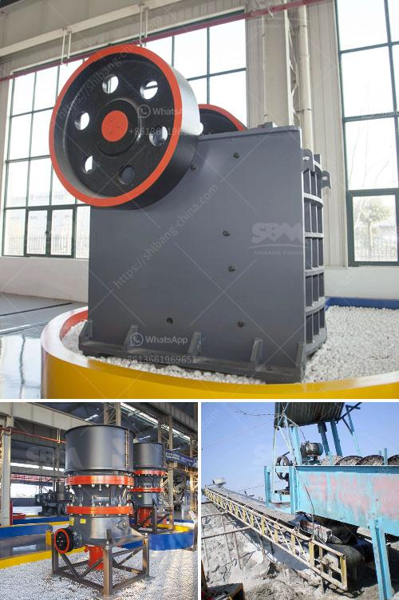

<h3>project report clay brick manufacturing</h3>
Clay bricks are the oldest and most utilized building material worldwide. They have been used in construction for thousands of years due to their excellent durability, strength, and thermal insulation properties. With the increasing demand for bricks in the construction industry, setting up a clay brick manufacturing project can be a lucrative venture. This article presents a comprehensive project report on clay brick manufacturing, covering various aspects such as market potential, manufacturing process, machinery requirements, and financial viability.

The construction industry is witnessing rapid growth globally, with increased investments in infrastructure development and residential projects. This has led to a surge in demand for building materials, including clay bricks. Clay bricks are extensively used in the construction of houses, commercial buildings, and civil structures. They are also preferred for their sustainability and low environmental impact compared to other materials. Hence, the market potential for clay bricks is significant, making it an attractive business opportunity.

The manufacturing process of clay bricks involves several steps, starting with the procurement of raw materials. The primary raw material for clay brick production is clay, which is usually sourced from nearby clay mines or quarries. The clay is then cleaned, prepared, and mixed with water to create a homogeneous mixture. This mixture is shaped into bricks using various techniques such as extrusion, molding, or hand-molding. The shaped bricks are then dried and fired in kilns at high temperatures to achieve the desired strength and durability. Finally, the bricks are cooled, inspected, and stored before being dispatched for sale.

To set up a clay brick manufacturing unit, certain machinery and equipment are essential. The basic machinery required includes clay mixers, crushers, pulverizers, extruders, brick-cutting machines, and kilns. Depending on the scale of production, automated or semi-automated machines can be used to increase efficiency and productivity. It is crucial to invest in reliable and durable machinery to ensure the smooth operation of the manufacturing process.

The financial viability of a clay brick manufacturing project depends on various factors, including the initial investment, operational costs, market demand, and selling price of the bricks. It is essential to conduct a detailed financial analysis before embarking on the project. The cost of land, machinery, raw materials, labor, utilities, and marketing should be carefully estimated. Additionally, the revenue projections based on the expected sales volume and selling price need to be calculated. Proper financial planning and cost management are crucial to ensure the project's profitability and long-term success.

Clay brick manufacturing is a promising business opportunity considering the growing demand for construction materials and the sustainability aspect of clay bricks. However, setting up a successful clay brick manufacturing unit requires thorough planning, market analysis, and effective implementation. This article provided an overview of the clay brick manufacturing project, covering market potential, manufacturing process, machinery requirements, and financial viability. With careful planning and execution, a clay brick manufacturing venture has the potential to be a profitable and sustainable business.
<h3>Contact us</h3><ul><li><strong>Whatsapp:&nbsp;<a href="https://wa.me/8613661969651">+8613661969651</a></strong></li><li><a href="https://swt.shibang-china.com/?git&amp;zhl&amp;project report clay brick manufacturing"><strong>Online Service(chat now)</strong></a></li></ul><h3>Related</h3><ul><li><a href='used portable rock crusher canada.md'>used portable rock crusher canada</a></li><li><a href='calcium carbonate powder crusher origin usa.md'>calcium carbonate powder crusher origin usa</a></li><li><a href='calcium carbonate grinding industries in india.md'>calcium carbonate grinding industries in india</a></li><li><a href='stone conveyor belt design manual pdf.md'>stone conveyor belt design manual pdf</a></li><li><a href='washing powder production line.md'>washing powder production line</a></li></ul>