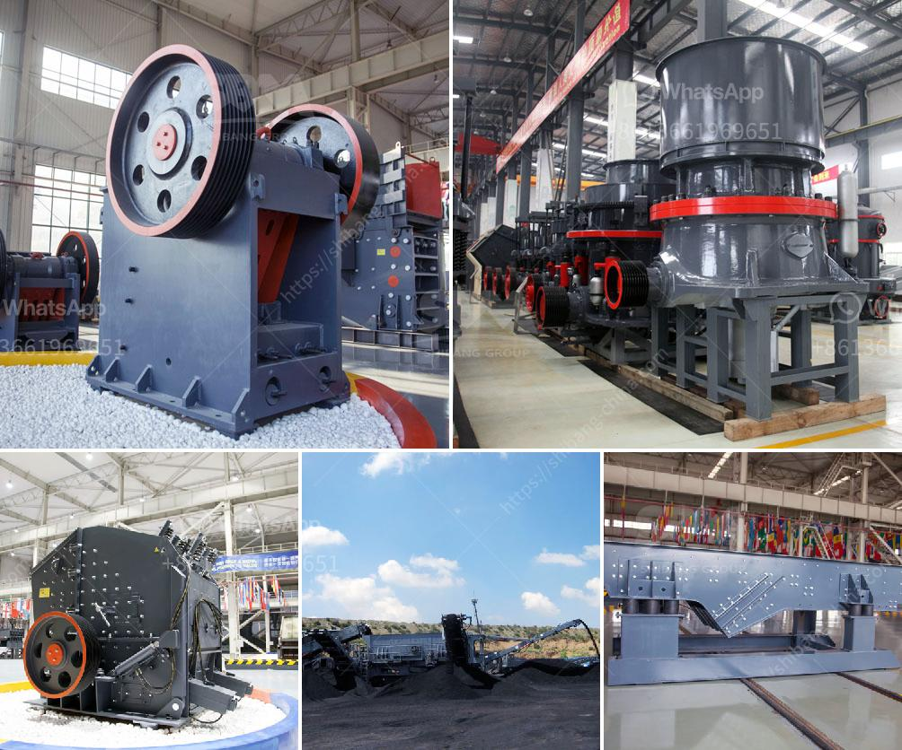

<h3>project report of dolomite powder plant</h3>
Dolomite is a carbonate mineral, mainly composed of calcium magnesium carbonate (CaMg(CO3)2). Dolomite is abundant in nature and can be found in various forms, such as limestone and marble. Due to its wide range of applications, dolomite is an essential raw material for numerous industries, including construction, ceramics, agriculture, and pharmaceuticals.

The project report of a dolomite powder plant presents details on the various stages of the plant's operation, from the initial feasibility study, to the financial analysis, and finally, to the actual production and distribution of dolomite powder. The report includes a comprehensive study of the market demand for dolomite powder, as well as an analysis of the competition and potential customers.

The preliminary stage of the project involves conducting a detailed feasibility study, which evaluates the technical and economic viability of the dolomite powder plant. This study includes the estimation of the plant capacity, machinery requirement, and the availability of raw materials. Additionally, it assesses the potential risks and challenges involved in the production process.

After the feasibility study, a financial analysis is carried out to determine the financial viability of the dolomite powder plant. This analysis involves the estimation of the project's cost, including fixed and working capital requirements, as well as the projected income and expenditures. It also evaluates the return on investment and the payback period.

Once the project is deemed feasible, the actual production and distribution of dolomite powder begin. The plant is set up with the necessary machinery and equipment, including crushers, pulverizers, and classifiers. The dolomite is mined, crushed, and then processed into powder form through grinding and classification processes. The final product is then packaged and distributed to various customers, such as construction companies and agricultural industries.

In conclusion, the project report of a dolomite powder plant provides a detailed overview of the entire project, from its feasibility study to the actual production and distribution processes. The report helps stakeholders understand the market demand for dolomite powder and assess the economic potential of the project. By implementing this project, it is expected that the demand for dolomite powder will be met, contributing to the growth and development of various industries.
<h3>Contact us</h3><ul><li><strong>Whatsapp:&nbsp;<a href="https://wa.me/8613661969651">+8613661969651</a></strong></li><li><a href="https://swt.shibang-china.com/?git&amp;zhl&amp;project report of dolomite powder plant"><strong>Online Service(chat now)</strong></a></li></ul><h3>Related</h3><ul><li><a href='making of calcium carbonate calcite powder.md'>making of calcium carbonate calcite powder</a></li><li><a href='south africa jaw crushers.md'>south africa jaw crushers</a></li><li><a href='indonesia ball mills in peru.md'>indonesia ball mills in peru</a></li><li><a href='big crushing machine.md'>big crushing machine</a></li><li><a href='pulverizer mining crusher 200 mesh.md'>pulverizer mining crusher 200 mesh</a></li></ul>