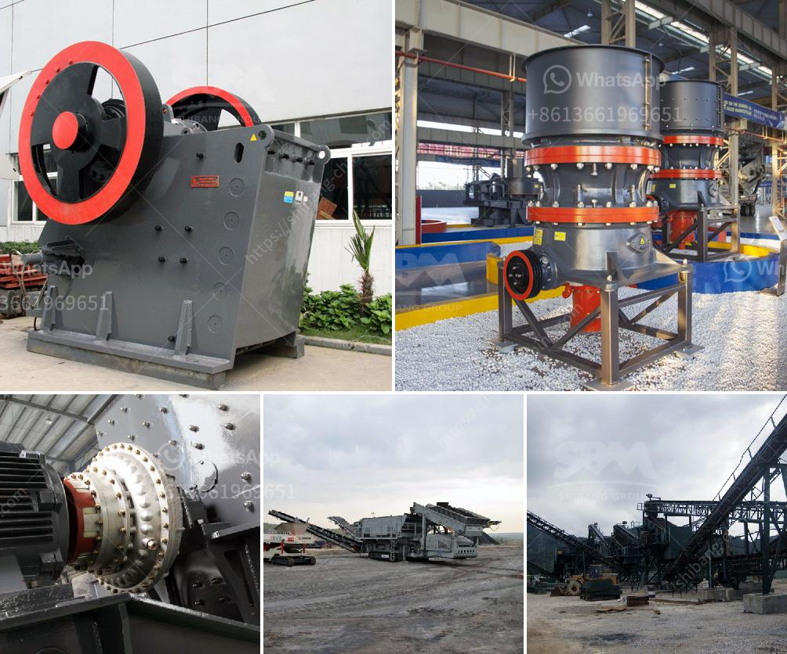

<h3>project report of m sand plant</h3>
M sand is crushed aggregates produced from hard granite stone which is cubically shaped with grounded edges, washed and graded with consistency to be used as a substitute of river sand. M sand plants or manufactured sand plants are effective alternatives for river sand, due to the depletion of good quality river sand for the use of construction purposes. These plants aim to produce quality sand, which can be used effectively in various construction projects.

A project report on M sand plant is a document that presents an overview of the proposed plant operations and objectives. The report includes information regarding the demand and supply of M sand, market trends, competitive landscape, cost analysis, equipment suppliers and finance options. It also includes a detailed project implementation schedule and a comprehensive financial analysis.

One of the key aspects of the project report is the feasibility study, which determines the economic viability of establishing an M sand plant. It involves analyzing various factors such as market demand, availability of raw materials, infrastructure requirements, labor availability, environmental considerations, and regulatory approvals. The feasibility study helps in identifying potential risks and challenges and provides recommendations to mitigate them.

The project report must analyze the market demand for M sand in the region where the plant is proposed to be set up. It includes an assessment of the current and future market size, growth potential, and key drivers of demand. This analysis helps in determining the production capacity of the plant and the market share it can capture.

The project report should provide details about the plant operations, including the process flow, equipment required, and production capacity. It should include information about the crushing process, washing and grading process, storage facilities, and transportation arrangements. The report should also discuss the quality control measures to ensure the production of high-quality M sand.

A detailed cost analysis is an essential part of the project report. It includes the estimation of capital expenditure, such as land, building, equipment, and infrastructure costs. It also includes the estimation of operational expenses, such as labor, raw material, power, and maintenance costs. The cost analysis helps in determining the project's profitability and potential return on investment.

The project report should include a comprehensive financial analysis, which includes projections of revenue, expenses, and profitability over a certain period. It should assess the project's financial viability and provide insights into the payback period, internal rate of return, and net present value. The financial analysis helps in evaluating the project's attractiveness to potential investors and lenders.

A project report on an M sand plant is crucial for understanding the feasibility and profitability of setting up such a plant. It provides a comprehensive overview of the market demand, plant operations, cost analysis, and financial projections. The report helps in making informed decisions regarding the project's implementation, financing, and management. With the increasing demand for M sand, such reports play a vital role in ensuring the successful establishment and operation of M sand plants.
<h3>Contact us</h3><ul><li><strong>Whatsapp:&nbsp;<a href="https://wa.me/8613661969651">+8613661969651</a></strong></li><li><a href="https://swt.shibang-china.com/?git&amp;zhl&amp;project report of m sand plant"><strong>Online Service(chat now)</strong></a></li></ul><h3>Related</h3><ul><li><a href='hammer mill and impactors unit.md'>hammer mill and impactors unit</a></li><li><a href='250 400 pe jaw crusher price list.md'>250 400 pe jaw crusher price list</a></li><li><a href='hand ball mill in south africa.md'>hand ball mill in south africa</a></li><li><a href='sand making crusher machine.md'>sand making crusher machine</a></li><li><a href='impact crusher design.md'>impact crusher design</a></li></ul>