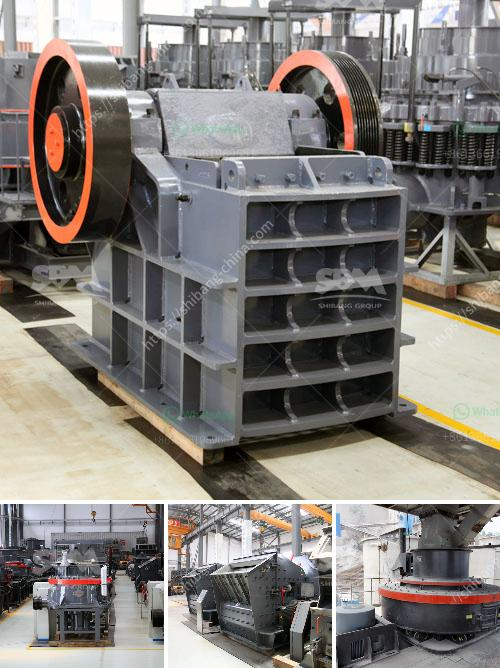

<h3>project report on mini kaolin mining crusher</h3>
A mini kaolin mining crusher, also known as a small-scale crushing plant, is a necessary equipment for mining industries. The mini crusher is specifically designed for reducing large fragments of kaolin into small pieces ensuring a uniform size for efficient processing. Although most kaolin deposits are found in larger quantities, the mini kaolin mining crusher provides an economical solution for small-scale mines with low production rates.

One of the key advantages of the mini crusher is its simplicity in design. Its small size and lightweight nature make it easy to transport and install in different locations. Additionally, the set-up process is relatively quick compared to larger crushers, which require heavy machinery and large construction sites. This compact design makes the mini crusher an ideal choice for small-scale mining operations with limited resources.

The mini crusher operates similarly to the larger crushers, utilizing a rotor that is designed to force large rocks into small fragments. The rotor is attached to a power source, such as an electric motor, which spins at a high speed. As the rocks are fed into the crusher, they are struck by the rotor and crushed into smaller pieces.

Another notable feature of the mini kaolin mining crusher is its ability to crush materials of different hardness levels. Kaolin is a soft mineral, but it can still be relatively hard, depending on the specific type and grade. The mini crusher is equipped with adjustable rotating blades that can be set to crush at various intensities, providing flexibility in achieving the desired product size.

The mini crusher also incorporates safety features to protect operators during the crushing process. It typically includes a protective cover to prevent accidents caused by flying debris or dust. Some models also have a built-in dust suppression system, which helps reduce the amount of dust released into the air during operation. These safety measures ensure a safe working environment for the operators.

In addition to its primary function of crushing kaolin, the mini crusher can also be used for other materials such as limestone, gypsum, or even some ores. This versatility makes it a valuable tool for various mining operations, enabling miners to process multiple types of materials using a single machine. This further enhances the cost-effectiveness and efficiency of the mini crusher.

In conclusion, a project report on a mini kaolin mining crusher highlights the importance of this equipment in small-scale mining operations. Its small size, simplicity in design, and ability to crush materials of different hardness levels make it an essential tool for efficient processing. The mini crusher not only offers an economical solution, but also ensures the safety of operators and provides versatility in processing various materials. With ongoing advancements in technology, the mini crusher continues to evolve, offering improved efficiency and productivity for the mining industry.
<h3>Contact us</h3><ul><li><strong>Whatsapp:&nbsp;<a href="https://wa.me/8613661969651">+8613661969651</a></strong></li><li><a href="https://swt.shibang-china.com/?git&amp;zhl&amp;project report on mini kaolin mining crusher"><strong>Online Service(chat now)</strong></a></li></ul><h3>Related</h3><ul><li><a href='brick crushing equipment.md'>brick crushing equipment</a></li><li><a href='iron slag buyers in punjab india.md'>iron slag buyers in punjab india</a></li><li><a href='ceramic ball mill.md'>ceramic ball mill</a></li><li><a href='limestone crushing mill.md'>limestone crushing mill</a></li><li><a href='coal washing process machine price.md'>coal washing process machine price</a></li></ul>