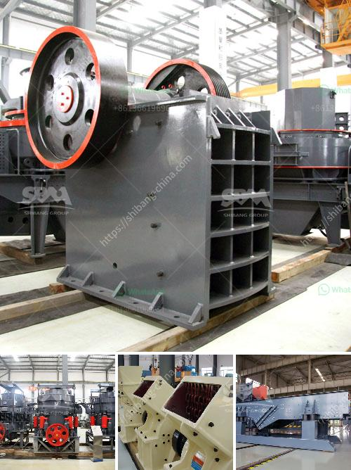

<h3>proposal for sand crushing machines industry</h3>
The sand crushing machines industry plays a significant role in the construction sector, and without appropriate machinery, this essential sector faces numerous challenges. Today, as new construction projects continue to rise and demand for quality sand increases, it becomes imperative to propose innovative solutions that can enhance the efficiency of sand crushing machines. This article presents a comprehensive proposal aimed at improving the industry's productivity by introducing cutting-edge technology and process optimization.

One of the primary objectives of this proposal is to introduce advanced sand crushing machines that can increase the overall efficiency and productivity of the industry. These machines would be equipped with innovative features, such as state-of-the-art sensors, multiple crushing chambers, and intelligent automated systems. By leveraging artificial intelligence, these machines would be able to adjust their parameters dynamically, resulting in more precise and efficient crushing processes. Moreover, the ability to monitor and analyze real-time data would allow operators to make more informed decisions and optimize the use of machinery, reducing both downtime and maintenance costs.

In recent years, sustainability has become a critical aspect of all industrial sectors. The sand crushing machines industry is no exception, and it is essential to address the environmental concerns associated with sand extraction and crushing. This proposal aims to encourage the adoption of sustainable practices through the use of energy-efficient machinery. Advanced crushing machines can integrate renewable energy sources like solar power, reducing reliance on conventional power grids and minimizing carbon emissions. Furthermore, emphasis on recycling and reusing sand can play a significant role in reducing the industry's impact on natural resources.

Safety is another crucial aspect that needs to be addressed within the sand crushing machines industry. The proposal suggests the integration of automation and robotics to enhance the safety of operators and workers. Automated processes, such as material handling, can reduce the need for human intervention in hazardous areas, minimizing the risks of accidents and injuries. Additionally, collaborative robots (cobots) can work alongside human operators, assisting them with heavy lifting and repetitive tasks, thereby mitigating the potential for strain-related injuries.

To further optimize the efficiency of the sand crushing machines industry, there needs to be a greater emphasis on data-driven decision-making. The proposal suggests implementing robust data collection and analysis systems that can provide valuable insights into the performance of the machines, production rates, and quality control. By leveraging predictive analytics and machine learning algorithms, operators can identify potential bottlenecks and proactively address them. This not only enhances efficiency but also contributes to more accurate cost estimation and resource allocation.

With the constant growth in construction activities, the sand crushing machines industry needs to evolve to meet the increasing demand for quality sand. This proposal outlines a path towards achieving optimized efficiency through the introduction of advanced machinery, sustainable practices, automation, and data-driven decision-making. By embracing these innovations, the industry can not only enhance its productivity but also ensure the safety of its workforce and reduce its environmental impact. Ultimately, this proposal aims to propel the sand crushing machines industry into an era of increased efficiency and sustainability.
<h3>Contact us</h3><ul><li><strong>Whatsapp:&nbsp;<a href="https://wa.me/8613661969651">+8613661969651</a></strong></li><li><a href="https://swt.shibang-china.com/?git&amp;zhl&amp;proposal for sand crushing machines industry"><strong>Online Service(chat now)</strong></a></li></ul><h3>Related</h3><ul><li><a href='cost estimates of a chrome processing plant.md'>cost estimates of a chrome processing plant</a></li><li><a href='screen size for kolberg screening plant.md'>screen size for kolberg screening plant</a></li><li><a href='puzzolana crushers coimbatore.md'>puzzolana crushers coimbatore</a></li><li><a href='stone crusher accounting in tally.md'>stone crusher accounting in tally</a></li><li><a href='graphite manufacturing plant.md'>graphite manufacturing plant</a></li></ul>