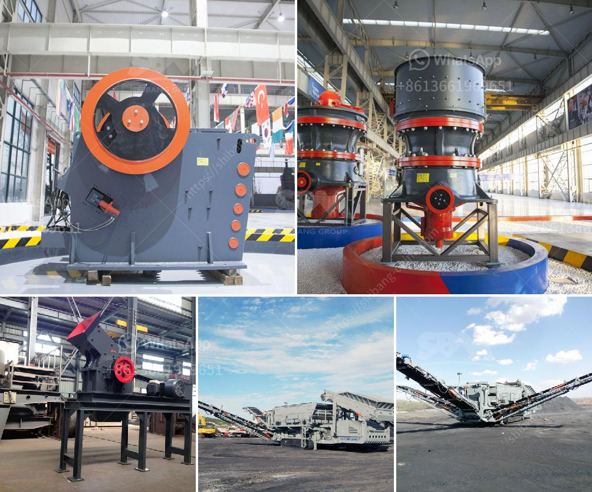

<h3>pulverizer crusher manufacturers in pune</h3>
Pune, or as it is famously called the "Oxford of the East", is not only known for its prestigious educational institutions but also for its industrial growth. The city has been a hub for manufacturing and engineering industries for decades. One such industry that has taken the city by storm is the pulverizer crusher manufacturing industry.

Pulverizer crushers are heavy-duty machines that are widely used to crush solid materials into smaller pieces. They are commonly used in industries such as mining, metallurgy, building materials, and chemical processing. With the advancements in technology, these crushers have become more efficient, reliable, and user-friendly.

Pune boasts of several pulverizer crusher manufacturers who are meeting the ever-increasing demand for these machines. These manufacturers are known for their top-quality products, customer-centric approach, and innovative solutions. They strive to provide the most reliable and durable crushers to their customers.

One of the leading pulverizer crusher manufacturers in Pune is Bharat Engineering Works. They specialize in manufacturing different types of crushers, including jaw crushers, impact crushers, hammer mills, vibrating screens, and more. Their crushers are known for their sturdy construction, exceptional performance, and low maintenance requirements. Bharat Engineering Works has a well-established reputation in the industry, and their crushers are widely used in various industrial applications.

Another renowned manufacturer in Pune is Technomart Engineers Pvt. Ltd. They offer a wide range of crushers that are designed to meet the specific requirements of different industries. Technomart Engineers Pvt. Ltd. is known for its superior quality products, timely delivery, and excellent after-sales service. They have a team of experienced professionals who work tirelessly to ensure the satisfaction of their customers.

Pulverizer crusher manufacturers in Pune are constantly striving to innovate and improve their products. They invest heavily in research and development to enhance the efficiency and performance of their crushers. These manufacturers also ensure that their crushers meet the highest safety standards to protect the workers and the environment.

In conclusion, Pune has emerged as a major hub for pulverizer crusher manufacturing. The city is home to several manufacturers who are known for their high-quality products and exceptional customer service. These manufacturers are playing a significant role in supporting various industries by providing them with reliable and efficient crushers. With the growing demand for pulverizer crushers, the manufacturers in Pune are ready to meet the needs and expectations of their customers in every possible way.
<h3>Contact us</h3><ul><li><strong>Whatsapp:&nbsp;<a href="https://wa.me/8613661969651">+8613661969651</a></strong></li><li><a href="https://swt.shibang-china.com/?git&amp;zhl&amp;pulverizer crusher manufacturers in pune"><strong>Online Service(chat now)</strong></a></li></ul><h3>Related</h3><ul><li><a href='feldspar stone crusher.md'>feldspar stone crusher</a></li><li><a href='lafarge evander quartz crushers.md'>lafarge evander quartz crushers</a></li><li><a href='stone crusher rotary screen in karnataka.md'>stone crusher rotary screen in karnataka</a></li><li><a href='gypsum crusher in salalah oman.md'>gypsum crusher in salalah oman</a></li><li><a href='rock crusher mobile machine.md'>rock crusher mobile machine</a></li></ul>