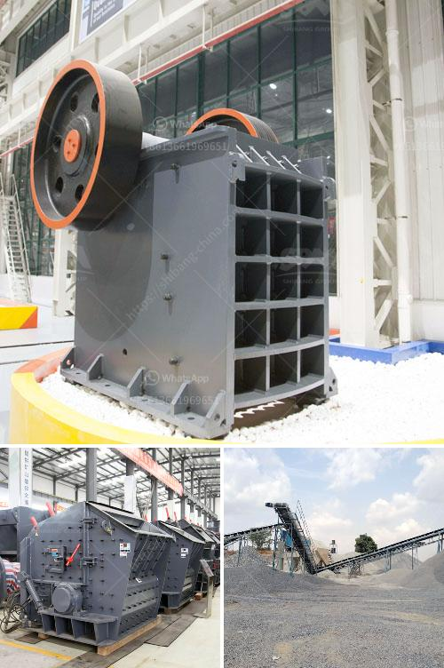

<h3>pulverizer cursher manufacturer</h3>
In the competitive world of manufacturing, quality products are essential to stay ahead of the competition. As industries strive to produce goods efficiently, pulverizer crusher manufacturers are stepping up to deliver world-class equipment. They play a crucial role in the success of various sectors such as construction, mining, and recycling by providing reliable machines to crush and pulverize materials.

One of the leading pulverizer crusher manufacturers in the industry is committed to continuous improvement and delivering top-notch equipment. With years of experience and a strong reputation, they have become a reliable partner for industries worldwide.

Reliability is a key factor when it comes to purchasing equipment. Pulverizer crusher manufacturers understand this and invest in high-quality materials and state-of-the-art technology to produce reliable machines. These machines are built to withstand tough conditions and heavy workloads, ensuring that they perform efficiently and consistently.

Another important aspect is versatility. Pulverizer crusher manufacturers offer a wide range of models and configurations to suit various applications. Whether it is crushing concrete, rocks, or other materials, these machines are designed to handle different types of materials effectively. This versatility allows industries to process a variety of materials without the need for multiple machines, saving time and money.

In addition to reliability and versatility, safety is a top priority for pulverizer crusher manufacturers. They adhere to strict safety regulations and standards to ensure their machines are safe to operate. These manufacturers incorporate safety features such as emergency stop buttons, safety guards, and warning signs to prevent accidents and injuries. By prioritizing safety, they provide peace of mind to operators and create a safe working environment.

Pulverizer crusher manufacturers also understand the importance of after-sales service. They provide comprehensive support to their customers, including installation assistance, maintenance, and spare parts. This ensures that their machines continue to perform optimally throughout their lifespan. Additionally, these manufacturers offer technical guidance and training to operators, empowering them to make the most out of their equipment.

Furthermore, environmental sustainability is a growing concern for industries. Pulverizer crusher manufacturers are aware of this and strive to produce equipment that minimizes environmental impact. They employ innovative technologies and design features to reduce energy consumption and emissions. By investing in environmentally-friendly equipment, these manufacturers contribute to a greener future and meet the demands of eco-conscious industries.

The success of pulverizer crusher manufacturers lies in their commitment to quality, reliability, versatility, safety, and sustainability. By delivering high-performing equipment and excellent customer support, they have become trusted partners to industries worldwide. These manufacturers continue to innovate and improve their machines to meet the evolving needs of various sectors.

In conclusion, the role of pulverizer crusher manufacturers in modern industries cannot be overstated. They are essential for efficient material processing and play a crucial role in the success of construction, mining, and recycling industries. With their commitment to quality, reliability, versatility, safety, and sustainability, these manufacturers provide invaluable equipment and support to industries worldwide.
<h3>Contact us</h3><ul><li><strong>Whatsapp:&nbsp;<a href="https://wa.me/8613661969651">+8613661969651</a></strong></li><li><a href="https://swt.shibang-china.com/?git&amp;zhl&amp;pulverizer cursher manufacturer"><strong>Online Service(chat now)</strong></a></li></ul><h3>Related</h3><ul><li><a href='coal pulverisers machines.md'>coal pulverisers machines</a></li><li><a href='stone crushers for sale south africa second hand.md'>stone crushers for sale south africa second hand</a></li><li><a href='concrete crushers for rent.md'>concrete crushers for rent</a></li><li><a href='diamond plant for sale in south africa.md'>diamond plant for sale in south africa</a></li><li><a href='stone crushing machines for sale in philippines.md'>stone crushing machines for sale in philippines</a></li></ul>