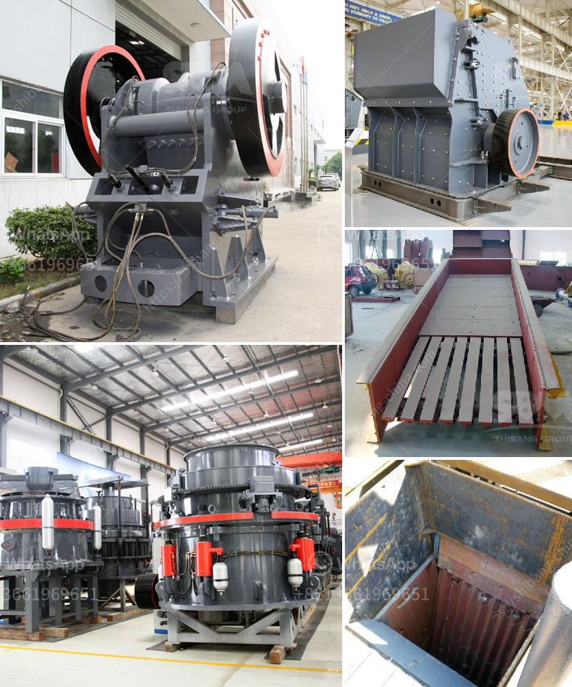

<h3>pulverizer mining crusher 200 mesh</h3>
Pulverizer mining crushers are machines used to reduce the size of minerals, rocks, and ores in a variety of industrial sectors. They are often used as a primary crusher in a mining operation where they are required to reduce the size of large rocks into smaller particles for further processing.

One type of pulverizer mining crusher is known as a swing hammer pulverizer. This machine uses a high-speed rotating hammer to fracture the material fed into it. The particles are then forced through a screen with small holes, typically measuring 200 mesh or finer.

The process of pulverizing rocks and minerals into smaller particles is important in various industries such as mining, construction, and metallurgy. In mining, these machines are used to crush and grind ores, allowing valuable minerals to be extracted from useless rock material.

The 200 mesh screen is commonly used in mining operations to separate particles of different sizes. A mesh size of 200 means that there are 200 openings per linear inch of the screen. Thus, a 200 mesh screen can filter out particles that are smaller than 1/200th of an inch.

The main advantage of using a pulverizer mining crusher with a 200 mesh screen is its ability to produce a consistent and uniform particle size. This is crucial in many industries where a precise particle size is required for optimal performance.

For example, in the pharmaceutical industry, the size of drug particles can impact the drug's absorption and effectiveness. In the construction industry, uniform particle size is needed for achieving the desired strength and durability of concrete.

Furthermore, pulverizer mining crushers with a 200 mesh screen can significantly increase the efficiency of ore processing. By reducing the size of the ore particles, more surface area is exposed, allowing for better leaching or extraction of valuable minerals.

Another advantage of using a pulverizer mining crusher with a 200 mesh screen is its versatility. These machines can handle a wide range of materials, including hard rocks, ores, and even certain industrial waste products. This flexibility makes them valuable in various industries.

In conclusion, pulverizer mining crushers with a 200 mesh screen play a crucial role in the mining industry by reducing the size of rocks, ores, and minerals. They offer various advantages, including uniform particle size, increased efficiency of ore processing, and versatility in handling different materials. As technology advances, these machines are likely to become even more efficient and indispensable in the mining sector.
<h3>Contact us</h3><ul><li><strong>Whatsapp:&nbsp;<a href="https://wa.me/8613661969651">+8613661969651</a></strong></li><li><a href="https://swt.shibang-china.com/?git&amp;zhl&amp;pulverizer mining crusher 200 mesh"><strong>Online Service(chat now)</strong></a></li></ul><h3>Related</h3><ul><li><a href='operation crushing plant.md'>operation crushing plant</a></li><li><a href='gypsum recycling machines for sale.md'>gypsum recycling machines for sale</a></li><li><a href='stone crusher plant project report.md'>stone crusher plant project report</a></li><li><a href='granite crushing machine for sale.md'>granite crushing machine for sale</a></li><li><a href='hp 500 cone crusher parts.md'>hp 500 cone crusher parts</a></li></ul>