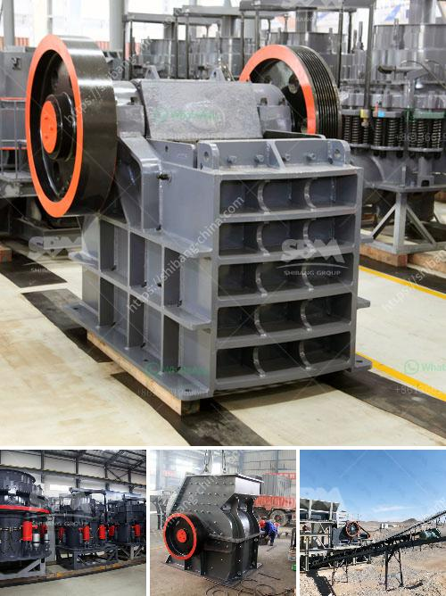

<h3>pulverizing machines in south africa</h3>
South Africa is a resource-rich country with a significant contribution to the global mining industry. The extraction and processing of minerals require advanced machinery to ensure efficiency and productivity. Pulverizing machines have emerged as indispensable equipment in various industries, enabling the transformation of large materials into smaller particles or powders. These machines are widely used in mining, construction, and recycling operations across South Africa, facilitating optimal utilization of resources in a sustainable and cost-effective manner.

Mining is one of the key sectors driving the South African economy. The country has abundant reserves of precious metals, coal, and minerals that demand efficient processing techniques. Pulverizing machines play a critical role in this process, reducing large rocks or ore into smaller particles for easier extraction and refinement. By pulverizing materials, mining companies can maximize their ore recovery, minimize waste generation, and enhance overall production capacity.

Furthermore, pulverizing machines have revolutionized the construction industry in South Africa. With the ever-growing demand for infrastructure development, the need for consistent and quality materials has become paramount. Pulverizers are used to crush and grind concrete, asphalt, and other construction materials, allowing builders to reuse these materials in new construction projects. This not only reduces construction costs but also promotes eco-friendly practices by minimizing resource wastage and reducing the burden on landfills.

In addition to mining and construction, pulverizing machines have gained prominence in the recycling industry. South Africa has been grappling with waste management challenges, and recycling initiatives have become crucial for sustainable development. These machines can process various waste materials such as glass, plastics, and paper, transforming them into reusable raw materials. By pulverizing waste, recycling plants can efficiently repurpose materials, reducing the strain on natural resources and minimizing environmental impact.

One of the key advantages of pulverizing machines is their versatility. They can be adapted to different materials and particle sizes, making them suitable for a wide range of industries. Various models of pulverizers are available in South Africa, including hammer mills, impact pulverizers, and ball mills. These machines can be tailored to meet specific requirements, ensuring optimal performance and energy efficiency.

Furthermore, the advancement of technology has led to the development of more sophisticated pulverizing machines in South Africa. Automation and computerized controls have greatly enhanced their precision and operational efficiency. Modern pulverizers are equipped with sensors and monitoring systems, allowing real-time analysis of production parameters. This ensures consistent product quality and reduces the risk of breakdowns or unplanned downtime, resulting in improved productivity and cost savings.

While pulverizing machines have revolutionized industrial operations in South Africa, it is vital to ensure responsible usage and maintenance. Proper training and adherence to safety protocols are necessary to prevent accidents and mitigate environmental risks associated with these machines. Regular servicing and inspection can prolong their lifespan and optimize performance.

In conclusion, pulverizing machines have become an integral part of the industrial landscape in South Africa. The mining, construction, and recycling sectors heavily rely on these machines to process materials efficiently and sustainably. With their versatility and technological advancements, pulverizers are facilitating resource utilization, reducing waste generation, and promoting a greener future for South Africa's industries.
<h3>Contact us</h3><ul><li><strong>Whatsapp:&nbsp;<a href="https://wa.me/8613661969651">+8613661969651</a></strong></li><li><a href="https://swt.shibang-china.com/?git&amp;zhl&amp;pulverizing machines in south africa"><strong>Online Service(chat now)</strong></a></li></ul><h3>Related</h3><ul><li><a href='plant crushing materials in antioquia.md'>plant crushing materials in antioquia</a></li><li><a href='concrete crusher for sale used in canada.md'>concrete crusher for sale used in canada</a></li><li><a href='jaw crusher maharashtra.md'>jaw crusher maharashtra</a></li><li><a href='gypsum calcination equipment.md'>gypsum calcination equipment</a></li><li><a href='crusher supplier saudi.md'>crusher supplier saudi</a></li></ul>