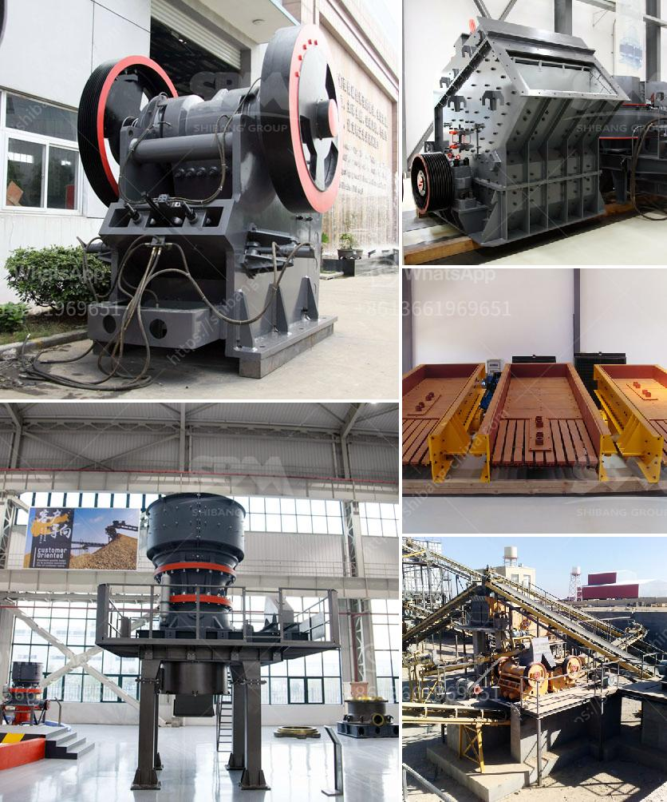

<h3>pure north crushing plant</h3>
Pure North Crushing Plant is a thriving aggregate crushing plant, which specializes in manufacturing top-quality aggregates for construction, civil engineering, and landscaping purposes. Located in Great Bear Lake, Northwest Territories, Pure North has been able to harness the abundance of natural resources in the region, making it one of the leading aggregate suppliers in the area.

The crushing plant boasts state-of-the-art machinery and highly skilled operators, ensuring the production of consistent and high-quality aggregates. With a production capacity of over 500 tons per hour, Pure North Crushing Plant has the ability to meet the demands of any large-scale construction project in the region.

One of the key factors that sets Pure North apart from its competitors is its commitment to environmental sustainability. The company ensures that its operations comply with environmental regulations and takes proactive steps in minimizing the impact on the surrounding ecosystem. This includes measures such as dust suppression systems, water recycling, and responsible waste management practices.

Moreover, Pure North Crushing Plant takes pride in its stringent quality control processes. Every batch of aggregates is carefully tested for quality, ensuring that it meets the required specifications for various construction applications. This attention to detail has earned the company a solid reputation for providing consistent and reliable aggregates.

The plant's strategic location in the Northwest Territories also allows it to cater to a wide range of clients, including those involved in remote infrastructure development. Pure North Crushing Plant is well-equipped to handle the logistical challenges of delivering aggregates to remote areas, ensuring that construction projects in these regions are not hindered by supply constraints.

In addition to its commitment to quality and sustainability, Pure North also recognizes the importance of building strong relationships with its clients. The company values open communication and strives to understand the unique needs and requirements of each project. This customer-centric approach has helped Pure North gain the trust and loyalty of its clientele, establishing it as a preferred aggregate supplier in the region.

Looking ahead, Pure North Crushing Plant is dedicated to continuous improvement and innovation. The company invests in research and development, constantly exploring new technologies and processes to enhance its efficiency and product offerings. By staying at the forefront of industry advancements, Pure North aims to exceed customer expectations and remain a leader in the aggregate market.

In conclusion, Pure North Crushing Plant is a well-established and reputable aggregate supplier. With its commitment to quality, sustainability, and customer satisfaction, the company has positioned itself as a trusted partner for construction projects in the region. Its advanced infrastructure, skilled operators, and dedication to continuous improvement ensure that Pure North will continue to thrive in the industry for years to come.
<h3>Contact us</h3><ul><li><strong>Whatsapp:&nbsp;<a href="https://wa.me/8613661969651">+8613661969651</a></strong></li><li><a href="https://swt.shibang-china.com/?git&amp;zhl&amp;pure north crushing plant"><strong>Online Service(chat now)</strong></a></li></ul><h3>Related</h3><ul><li><a href='sand and quarry importer in singapore.md'>sand and quarry importer in singapore</a></li><li><a href='fly ash processing plant.md'>fly ash processing plant</a></li><li><a href='components of mobile coal processing plant.md'>components of mobile coal processing plant</a></li><li><a href='rock crusher machine equipment in canada.md'>rock crusher machine equipment in canada</a></li><li><a href='were to buy old rock crusher.md'>were to buy old rock crusher</a></li></ul>