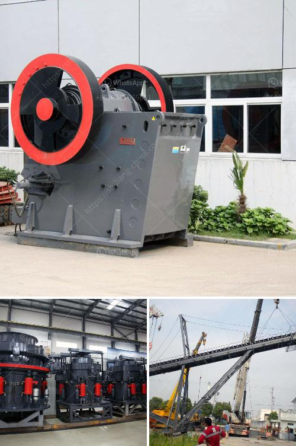

<h3>puzzolana crushers coimbatore</h3>
Puzzolana Crushers Coimbatore is undoubtedly one of the best and most reliable sources for all types of crushing and screening machinery. Serving the industry for more than three decades, they have established themselves as a leading manufacturer, exporter, and supplier of a wide range of aggregate and mineral processing equipment.

Located in the heart of Coimbatore, Tamil Nadu, Puzzolana Crushers Coimbatore has been striving to deliver cost-effective and reliable solutions to its customers. With a focus on innovation and cutting-edge technology, the company has been at the forefront of providing the latest and most advanced machinery for various industries, including mining, construction, and infrastructure development.

Puzzolana Crushers Coimbatore offers a comprehensive range of machinery, including jaw crushers, cone crushers, and vertical shaft impactors. Their jaw crushers are renowned for their sturdy construction, efficient performance, and low operating costs. Whether it's crushing hard and abrasive rocks or recycling construction debris, their jaw crushers are designed to handle the toughest of applications.

The cone crushers from Puzzolana Crushers Coimbatore are equally impressive. These machines are known for their exceptional productivity, high reduction ratio, and excellent product shape. With advanced features such as hydraulic adjustment, automatic control systems, and overload protection, these cone crushers ensure reliable and efficient crushing operations.

Another product that sets Puzzolana Crushers Coimbatore apart from its competitors is their vertical shaft impactors (VSI). These machines are widely used in the production of high-quality artificial sand, shaping of aggregates, and recycling of construction materials. With their unique rock-on-rock crushing principle, Puzzolana's VSI crushers deliver consistent particle size distribution, reduced maintenance costs, and superior product shape.

In addition to their wide range of crushing machinery, Puzzolana Crushers Coimbatore also offers a complete line of screening equipment. From inclined screens and horizontal screens to high-frequency screens and multi-slope screens, they have a solution for every screening requirement. These screens are designed to deliver high throughput, accurate sizing, and efficient material separation.

What makes Puzzolana Crushers Coimbatore stand out is their commitment to customer satisfaction. They understand the specific needs and requirements of their clients and strive to provide tailored solutions that meet their expectations. With a highly skilled team of engineers and technicians, they offer customized designs, on-site installation support, and seamless after-sales service.

Moreover, the company emphasizes continuous research and development to stay ahead of the competition. Their state-of-the-art manufacturing facility is equipped with the latest machinery, allowing them to deliver high-quality products with shorter lead times. Additionally, they have a strong network of dealers and distributors, ensuring their reach to customers across various geographical locations.

In conclusion, Puzzolana Crushers Coimbatore is a name synonymous with reliability, innovation, and quality in the field of crushing and screening machinery. With a diverse range of products, a customer-centric approach, and a commitment to delivering excellence, they have become a preferred choice for industries seeking advanced and efficient solutions. Whether it's mining, construction, or infrastructure development, Puzzolana Crushers Coimbatore is the go-to source for all your crushing and screening needs.
<h3>Contact us</h3><ul><li><strong>Whatsapp:&nbsp;<a href="https://wa.me/8613661969651">+8613661969651</a></strong></li><li><a href="https://swt.shibang-china.com/?git&amp;zhl&amp;puzzolana crushers coimbatore"><strong>Online Service(chat now)</strong></a></li></ul><h3>Related</h3><ul><li><a href='chinese diesel propelled stone crushers for sale.md'>chinese diesel propelled stone crushers for sale</a></li><li><a href='how to select machines for stone crushing plant.md'>how to select machines for stone crushing plant</a></li><li><a href='washing powder production line.md'>washing powder production line</a></li><li><a href='feldspar stone crusher.md'>feldspar stone crusher</a></li><li><a href='cost of vertical roller mill.md'>cost of vertical roller mill</a></li></ul>