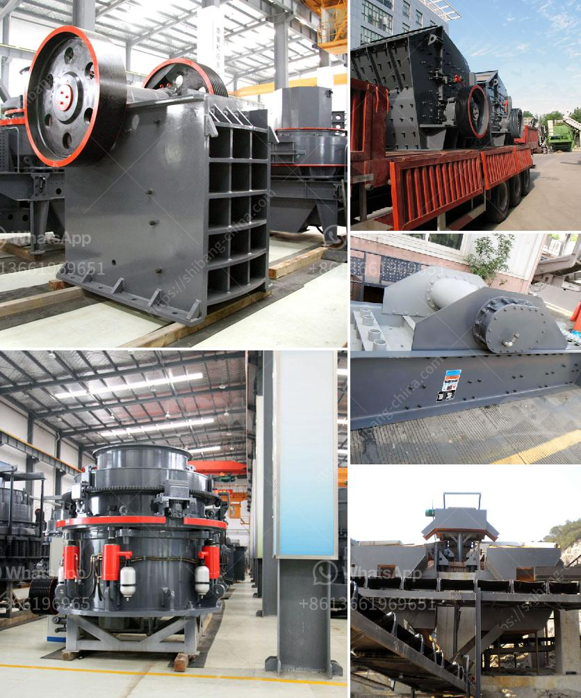

<h3>quarring and crushing and cost</h3>
Quarrying and crushing are basic operations in the construction industry, particularly for the creation of roads, buildings, and bridges. Whether it is limestone, granite, or gravel, quarries play an essential role in economic development. 

The process of quarrying involves extracting natural resources from the ground, which are then transported to crushing plants to be transformed into various sizes of aggregates. These aggregates are used in asphalt, concrete, and other construction projects. 

One of the key factors that affect the economics of quarrying and crushing is the cost of transportation. Quarry sites are generally located far from the construction sites, necessitating the need for trucks or trains to transport materials. The longer the distance and the larger the volume, the higher the transportation cost. Consequently, quarries closer to construction sites have a clear advantage due to reduced transportation expenses.

Another significant cost factor is the equipment used in the quarries. The upfront investment in crushers, screens, excavators, and loaders can be substantial. Additionally, operating and maintaining these machines require additional expenses. Therefore, efficient utilization and appropriate maintenance practices can help minimize downtime and improve overall productivity, thus reducing costs.

Moreover, the efficiency of the crushing process also plays a crucial role in cost management. Efficient crushing ensures maximum yield of high-quality aggregates while minimizing waste. Implementing innovative technologies, such as computer modeling and automation, can enhance the productivity of the crushers and reduce energy consumption, leading to significant cost savings.

Furthermore, environmental regulations and sustainability considerations have become increasingly important in recent years. Quarrying and crushing operations must comply with various environmental standards and regulations, which may entail additional costs for acquiring permits and implementing mitigation measures. However, embracing sustainable practices, such as recycling and reusing materials, can help reduce environmental impact and generate cost savings in the long run.

In conclusion, quarrying and crushing operations are integral to the construction industry's supply chain. Understanding the economics of these processes is crucial for efficient project management and cost control. By optimizing transportation, equipment utilization, and crushing efficiency, businesses can minimize costs and maximize profitability while ensuring environmental compliance.
<h3>Contact us</h3><ul><li><strong>Whatsapp:&nbsp;<a href="https://wa.me/8613661969651">+8613661969651</a></strong></li><li><a href="https://swt.shibang-china.com/?git&amp;zhl&amp;quarring and crushing and cost"><strong>Online Service(chat now)</strong></a></li></ul><h3>Related</h3><ul><li><a href='chinese mobile crusher.md'>chinese mobile crusher</a></li><li><a href='stone crusher price per.md'>stone crusher price per</a></li><li><a href='100tph stone crusher.md'>100tph stone crusher</a></li><li><a href='chromium ore mining equipmentr.md'>chromium ore mining equipmentr</a></li><li><a href='machine for crushing rock.md'>machine for crushing rock</a></li></ul>