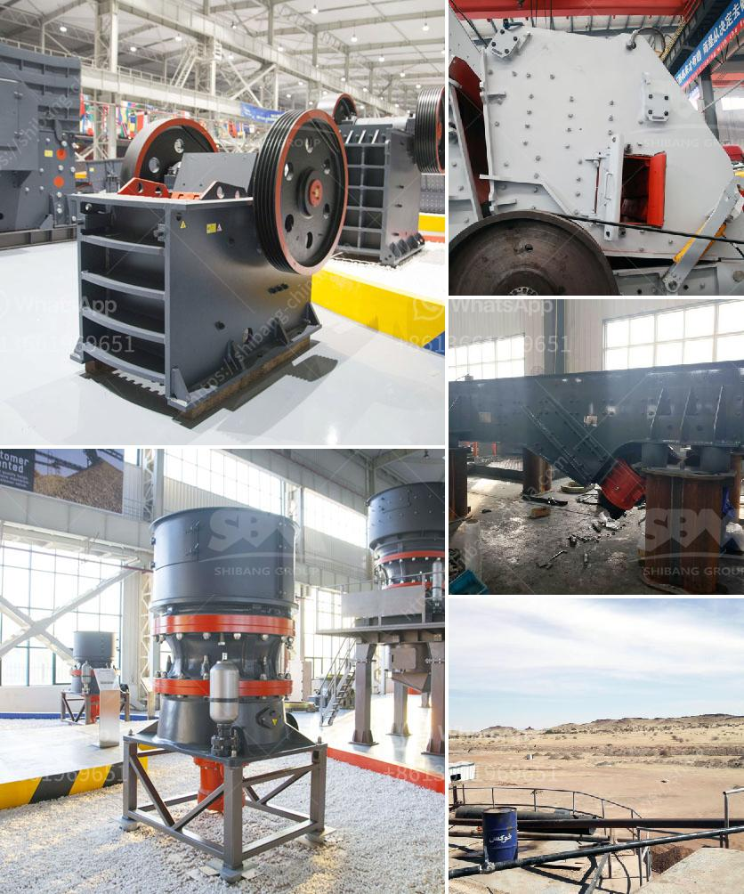

<h3>quarry causer machine</h3>
Rock quarries create immense amounts of noise, vibration, and air pollution. In many cases, the industry is a culprit for excess groundwater depletion too. Quarrying is undoubtedly a noisy and destructive activity that disrupts the natural ecosystem and affects wildlife significantly. To mitigate these negative impacts, quarry companies use different machines and techniques to manage their operations, but unfortunately, these machines can also be responsible for causing additional harm.

One of the primary machines used in quarrying is the crusher. Crushers are designed to break large-sized rocks into smaller pieces or to pulverize rocks into small fragments. They are commonly used in quarries for the production of aggregates, which are essential materials needed for construction projects such as roads, railways, and buildings.

However, these crushers generate immense noise during operation. The continuous pounding of rocks against each other creates a thunderous noise that can be heard for miles around. This noise pollution can be highly disruptive for local communities, causing disturbances in sleep patterns, increased stress levels, and impaired concentration. Moreover, the noise can negatively impact the local wildlife, causing distress, habitat disruption, and potential displacement.

Aside from noise, crushers also produce strong vibrations during their operation. Vibrations can be transferred to nearby structures, damaging buildings and causing cracks in walls and foundations. This can be a serious concern, especially for residential areas located in close proximity to quarries. The vibrations can also disturb the natural habitat of nearby wildlife, impacting their behavior and potentially causing harm.

In addition to noise and vibration, quarry crushers also contribute to air pollution. Dust generated from the crushing process is a major source of air pollution. These fine particles suspended in the air can cause respiratory problems for humans and animals, leading to various health issues. High levels of dust can also affect visibility on nearby roads, increasing the risk of accidents for motorists.

Furthermore, quarry machines, including crushers, require a significant amount of energy to operate. The heavy machinery relies on fossil fuels to power their engines, contributing to greenhouse gas emissions and climate change. This adds an environmental burden to an already environmentally destructive industry.

To address these issues, quarry companies should invest in advanced technologies and practices to reduce their environmental footprint. Implementing measures like using specialized noise-reducing enclosures or barriers around crushers can help control noise pollution. Vibrational dampening systems can be employed to minimize vibrations, protecting nearby structures and ecosystems.

Moreover, implementing dust control measures such as using water sprays or enclosing the crushing area can help minimize air pollution caused by the crushers. Routine maintenance of the machines is also crucial to ensure optimal performance, reducing emissions and maximizing energy efficiency.

Government regulations and policies play a vital role in monitoring and controlling quarry operations. Stricter regulations on noise, air quality, and water usage can hold quarry companies accountable for their impact on the environment and encourage them to adopt more sustainable practices.

In conclusion, quarry crusher machines are undeniable culprits for causing noise, vibration, and air pollution, which disrupt the natural ecosystem and negatively impact nearby communities. However, by adopting advanced technologies, implementing measures to control noise, vibration, and dust pollution, and complying with stricter regulations, the industry can mitigate its negative environmental impact and move towards more sustainable quarrying practices.
<h3>Contact us</h3><ul><li><strong>Whatsapp:&nbsp;<a href="https://wa.me/8613661969651">+8613661969651</a></strong></li><li><a href="https://swt.shibang-china.com/?git&amp;zhl&amp;quarry causer machine"><strong>Online Service(chat now)</strong></a></li></ul><h3>Related</h3><ul><li><a href='trading industrial stone crushers.md'>trading industrial stone crushers</a></li><li><a href='basalt crusher production.md'>basalt crusher production</a></li><li><a href='coal processing plant in philippines.md'>coal processing plant in philippines</a></li><li><a href='limestone processing limestone processing plant.md'>limestone processing limestone processing plant</a></li><li><a href='japan of mobile crushing plant.md'>japan of mobile crushing plant</a></li></ul>