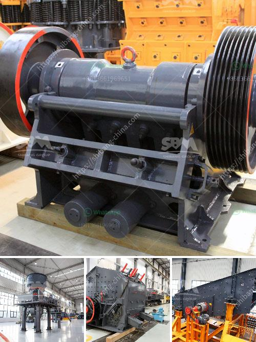

<h3>quarry crusher equipment for sale in usa</h3>
The mining industry has always been a major contributor to the country's economy, and it is a sector that never goes out of demand. With the increasing need for raw materials like crushed stone, sand, and gravel, the demand for quarry crusher equipment in the USA is on the rise.

Quarry operations in the USA involve extracting various minerals and materials for construction purposes. These operations require specialized equipment to break down and process large rocks into smaller, more manageable sizes. This is where quarry crusher equipment comes into play, as it can efficiently and effectively crush the materials needed for construction projects.

When it comes to quarry crusher equipment for sale in the USA, there are several factors to consider before making a purchase. The first and foremost consideration is the type and size of the material being processed. Different crushers are designed to handle different types of materials, such as limestone, granite, or recycled concrete.

Another crucial factor to consider is the capacity or the amount of material the crusher can process in a given timeframe. For instance, if your site demands a higher production rate, you would need a crusher with a higher capacity to meet your requirements.

Additionally, it is essential to consider the power source of the crusher. Some crushers can be powered by electricity, while others require diesel or gasoline engines. The choice of power source depends on factors such as availability, cost, and environmental impact.

Furthermore, the design and features of the crusher equipment are significant considerations. Look for equipment with user-friendly controls, easy maintenance, and safety features. The durability and reliability of the equipment are also crucial to ensure uninterrupted operation and minimal downtime.

One of the advantages of buying quarry crusher equipment in the USA is the availability of a wide range of options. Many reputable manufacturers and suppliers offer a variety of crushers to suit different applications and budgets. Whether you are looking for a stationary or mobile crusher, there are plenty of choices to meet your needs.

Moreover, it is important to partner with a reliable equipment dealer or supplier who can provide after-sales support, spare parts, and service. A dealer with a good reputation and experience in the industry can guide you in choosing the right crusher equipment and ensure its proper installation and maintenance.

In conclusion, quarry crusher equipment plays a vital role in the mining industry, and its demand is increasing in the USA. When considering purchasing quarry crusher equipment, it is crucial to assess factors such as the type of material, capacity, power source, and design features. With a wide range of options available and the support of a reputable dealer, you can find the right equipment to meet your needs and enhance your quarry operations.
<h3>Contact us</h3><ul><li><strong>Whatsapp:&nbsp;<a href="https://wa.me/8613661969651">+8613661969651</a></strong></li><li><a href="https://swt.shibang-china.com/?git&amp;zhl&amp;quarry crusher equipment for sale in usa"><strong>Online Service(chat now)</strong></a></li></ul><h3>Related</h3><ul><li><a href='stone crusher plant project report.md'>stone crusher plant project report</a></li><li><a href='machines used for coal mining.md'>machines used for coal mining</a></li><li><a href='vertical vertical roller mill drives.md'>vertical vertical roller mill drives</a></li><li><a href='stone crushers suppliers.md'>stone crushers suppliers</a></li><li><a href='ore processing plant for sale.md'>ore processing plant for sale</a></li></ul>