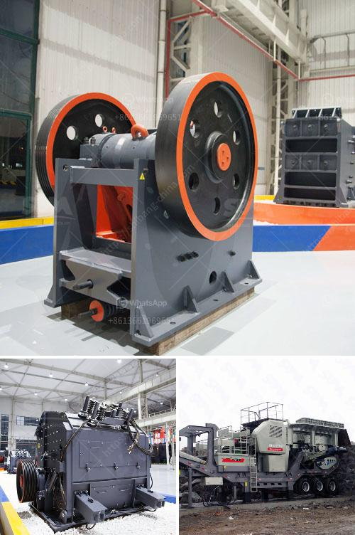

<h3>quarry crusher machinery for sale</h3>
Quarrying is a thriving industry that has come a long way over the years. With technological advancements, efficient machinery, and sustainable practices, quarrying has become highly productive, safe, and environmentally friendly.

One essential piece of equipment in quarrying is the quarry crusher machinery. Crusher machines are used to break up stones into smaller-sized pieces, usually for gravel or construction aggregates. These machines are essential in a quarrying operation as they reduce the size of the larger stones, making them easier to transport and use.

When looking to invest in quarry crusher machinery for sale, it is important to consider various factors to ensure you choose the right equipment that fits your needs. Let's explore some of the benefits and considerations when purchasing quarry crusher machinery.

1. Increased Efficiency: Quarry crusher machinery allows for the efficient processing of raw materials. These machines are designed to handle large volumes of material and break them down into smaller, uniform-sized pieces. As a result, quarry operators can produce more product in a shorter amount of time, boosting overall production efficiency.

2. Versatility: Quarry crusher machinery is available in various types and models, allowing operators to choose the one that is best suited for their specific needs. From jaw crushers to impact crushers, cone crushers, and vertical shaft impactors, there are options for different applications and output requirements.

3. Cost Savings: Investing in quarry crusher machinery can lead to cost savings in the long run. With the ability to process materials on-site, quarry operators can avoid transportation costs and haulage fees. Additionally, efficient machinery can help minimize downtime and reduce maintenance and repair costs.

1. Capacity and Production Requirements: The size of the quarry and the expected production requirements play a crucial role in selecting the right crusher machinery. Determine the capacity and output needed to ensure the chosen machine meets those requirements effectively.

2. Maintenance and Support: Quarry crusher machinery requires regular maintenance to ensure optimal performance and longevity. Consider the availability of spare parts, manufacturer support, and after-sales service when choosing a machine. It is also advisable to invest in training for your team to handle routine maintenance tasks to avoid unnecessary downtime.

3. Environmental Considerations: Quarrying operations can have various environmental impacts, including dust and noise pollution. Look for crusher machinery with built-in features that mitigate these concerns, such as dust suppression systems or noise reduction technology.

4. Safety Features: Ensure that the crusher machinery you choose comes with adequate safety features to protect operators and prevent accidents. These may include guards, safety switches, and emergency stop buttons.

Quarry crusher machinery plays a vital role in the quarrying industry, helping to break down large stones into smaller, usable aggregates. When investing in quarry crusher machinery, consider factors such as efficiency, versatility, cost savings, and maintenance requirements. By making an informed decision, quarry operators can enhance their operations, improve productivity, and contribute to sustainable practices in the industry.
<h3>Contact us</h3><ul><li><strong>Whatsapp:&nbsp;<a href="https://wa.me/8613661969651">+8613661969651</a></strong></li><li><a href="https://swt.shibang-china.com/?git&amp;zhl&amp;quarry crusher machinery for sale"><strong>Online Service(chat now)</strong></a></li></ul><h3>Related</h3><ul><li><a href='enquiry impact crusher.md'>enquiry impact crusher</a></li><li><a href='manufacturer of slag roller crusher in philippines.md'>manufacturer of slag roller crusher in philippines</a></li><li><a href='dolomite crusher manufacturer in nagpur.md'>dolomite crusher manufacturer in nagpur</a></li><li><a href='basalt production machinery.md'>basalt production machinery</a></li><li><a href='limestone quarry operations.md'>limestone quarry operations</a></li></ul>