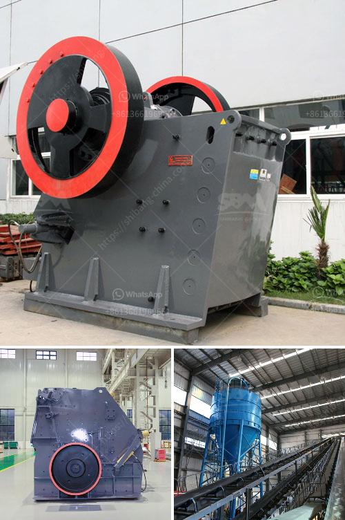

<h3>quarry equipment manufacturer</h3>
The mining industry relies heavily on materials such as limestone, granite, and sand, which are essential for the extraction of minerals used in various industrial applications. These minerals are extracted from quarries using a range of heavy-duty equipment specially designed for this purpose. Quarry equipment manufacturers play a crucial role in providing the tools needed for this demanding industry.

A quarry equipment manufacturer is responsible for designing, manufacturing, and supplying equipment that is required for various stages of quarrying operations. They cater to the needs of the industry by creating specialized machinery that can withstand the tough conditions of quarrying, maximize productivity, and ensure worker safety.

One of the key equipment supplied by a quarry equipment manufacturer is the rock crusher. Crushers are used to break down large rocks into smaller, more manageable sizes that can be used for construction, road building, and other applications. A quality rock crusher is designed to crush even the hardest of materials efficiently and reliably.

Another essential piece of equipment provided by quarry equipment manufacturers is the screening machine. These machines are used to separate crushed materials into different sizes and are vital for the production of high-quality aggregates, which serve as the main building blocks in construction projects.

Additionally, quarry equipment manufacturers offer specialized machinery for the transportation of materials within a quarry site. This includes loaders, excavators, bulldozers, and trucks, capable of carrying heavy loads over rough terrain.

In recent years, many quarry equipment manufacturers have also integrated advanced technologies into their machinery. This includes the use of computerized systems, automation features, and remote-controlled operation, making the equipment more efficient, safer, and easier to operate.

The quarry equipment manufacturing industry plays a vital role in supporting the mining industry's growth by supplying the necessary tools and machinery for extracting valuable minerals. Without these equipment manufacturers, mining operations would be significantly hindered, affecting the availability and affordability of materials essential for various industries.

In conclusion, quarry equipment manufacturers play a crucial role in the mining industry by designing, manufacturing, and supplying specialized equipment that is essential for the extraction and processing of minerals. They continuously strive to innovate and integrate advanced technologies into their machinery to make quarrying operations more efficient, cost-effective, and safe. As the demand for raw materials continues to grow, the quarry equipment manufacturing industry will remain a vital component of the mining sector.
<h3>Contact us</h3><ul><li><strong>Whatsapp:&nbsp;<a href="https://wa.me/8613661969651">+8613661969651</a></strong></li><li><a href="https://swt.shibang-china.com/?git&amp;zhl&amp;quarry equipment manufacturer"><strong>Online Service(chat now)</strong></a></li></ul><h3>Related</h3><ul><li><a href='italia gypsum block making mechines.md'>italia gypsum block making mechines</a></li><li><a href='cost of 200 tpd clinker grinding plant.md'>cost of 200 tpd clinker grinding plant</a></li><li><a href='small mobile gold grinding mill in philippines.md'>small mobile gold grinding mill in philippines</a></li><li><a href='ball mill how to grind mineral.md'>ball mill how to grind mineral</a></li><li><a href='lime crushing plant components.md'>lime crushing plant components</a></li></ul>