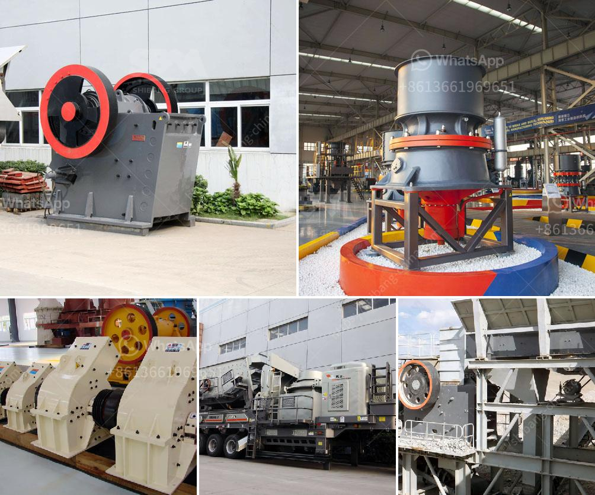

<h3>quarry equipment prices</h3>
Quarries are essential to the construction industry, providing the necessary materials to build roads, bridges, buildings, and other infrastructure projects. However, operating a quarry requires a significant investment in machinery and equipment to extract, process, and transport materials. In this article, we will discuss the prices of quarry equipment and how they can impact a quarry's profitability.

The prices of quarry equipment can vary greatly depending on the type of machinery needed. Some common types of quarry equipment include excavators, loaders, crushers, conveyors, and screening plants. Each type of equipment has different specifications and features, which can affect its price.

Excavators are heavy construction machines used to dig trenches, foundations, and excavate materials. Their cost can range from $50,000 to several hundred thousand dollars, depending on their size, capacity, and additional attachments like buckets and hydraulic hammers.

Loaders, another commonly used quarry equipment, are used to move materials around the site. Prices for loaders can range from $50,000 to $200,000, depending on their size and features like lift capacity and fuel efficiency.

Crushers are essential for breaking down large rocks into smaller, more manageable sizes. The cost of a crusher can range from $200,000 to several million dollars, depending on its capacity, features, and mobility options.

Conveyors and screening plants are used to transport and sort materials, respectively. The prices of conveyors can range from $10,000 to $100,000, depending on their length, capacity, and motor size. Screening plants can cost anywhere from $50,000 to $500,000, depending on their size, capacity, and mobility options.

When considering the prices of quarry equipment, it is important to factor in additional costs like maintenance, repairs, and fuel consumption. These costs can be significant and should be taken into account when budgeting for quarry operations.

Another important consideration is the lifespan of the equipment. Quarry equipment is subjected to heavy wear and tear, and regular maintenance and repairs are necessary to keep them in optimal condition. Older equipment may require more frequent repairs and have a shorter lifespan, while newer, more technologically advanced models tend to be more durable and efficient.

The prices of quarry equipment can also be influenced by market demand and competition. In areas with numerous quarries, equipment prices may be more competitive as suppliers seek to attract customers. On the other hand, in areas with limited quarry options, prices may be higher due to supply and demand dynamics.

Despite the substantial upfront costs, investing in high-quality quarry equipment can lead to significant long-term savings and profitability. Efficient machinery can increase productivity, reduce operating costs, and improve the quality of the extracted materials. It is crucial for quarry operators to consider their specific needs, budget, and long-term goals when choosing equipment.

In conclusion, the prices of quarry equipment can vary widely depending on the type of machinery and its specifications. Quarry operators should carefully consider their needs, budget, and long-term goals when investing in equipment. Regular maintenance, repairs, and operating costs should also be factored in to ensure profitability and efficiency in quarry operations.
<h3>Contact us</h3><ul><li><strong>Whatsapp:&nbsp;<a href="https://wa.me/8613661969651">+8613661969651</a></strong></li><li><a href="https://swt.shibang-china.com/?git&amp;zhl&amp;quarry equipment prices"><strong>Online Service(chat now)</strong></a></li></ul><h3>Related</h3><ul><li><a href='coal mining process machinery.md'>coal mining process machinery</a></li><li><a href='limestone crushing mill.md'>limestone crushing mill</a></li><li><a href='jaw crusher for sale in ghana.md'>jaw crusher for sale in ghana</a></li><li><a href='sand washing machines for crusher nepal.md'>sand washing machines for crusher nepal</a></li><li><a href='stone portable crusher.md'>stone portable crusher</a></li></ul>