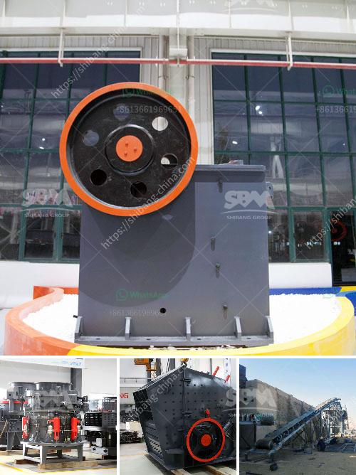

<h3>quarry plant making machine for sale in zimbabwe</h3>
Zimbabwe is rich in natural resources, such as minerals, gold, coal, chrome, iron ore, and granite. Quarry plant making machine plays a crucial role in Zimbabwe mining industry and economy. In the quarry plant, the hot selling quarry crushing machine is the mobile cone crusher, and our DRAGON mobile crushing plant systems is widely used in the granite and basalt stone production line. 

In Zimbabwe, the most popular quarry plant machines are the vibrating feeder, vibrating screen, and belt conveyor. These machines will work together in a whole quarry plant and play a crucial role in the ore conveying process. The vibrating feeder can feed large stone materials evenly and continuously to the primary crusher, while the vibrating screen is used to screen crushed stones for different sizes. The belt conveyor will transport the processed materials to the next stage. 

The quarry plant making machine is designed with simple structure, easy operation, reliable performance, and low production cost. It allows for flexible movement and convenient transportation. With the increasing demand for stones in Zimbabwe's construction industry, the quarry plant making machine for sale is in high demand.

As the leading manufacturer and supplier of quarry plant making machines in Zimbabwe, we not only provide the high-quality machines but also offer customized solutions to meet individual requirements. Our experienced engineers and technicians are dedicated to ensuring the smooth operation and efficient performance of the quarry plant making machine.

With our quarry plant making machine, Zimbabwe can produce high-quality stones for various construction projects. Furthermore, the quarrying industry can create employment opportunities and contribute to the economic growth of Zimbabwe.

If you are interested in the quarry plant making machine for sale in Zimbabwe, please contact us for more details. We are committed to providing the best products and services to our customers and helping them achieve success in their business endeavors.
<h3>Contact us</h3><ul><li><strong>Whatsapp:&nbsp;<a href="https://wa.me/8613661969651">+8613661969651</a></strong></li><li><a href="https://swt.shibang-china.com/?git&amp;zhl&amp;quarry plant making machine for sale in zimbabwe"><strong>Online Service(chat now)</strong></a></li></ul><h3>Related</h3><ul><li><a href='cost for the ball mill machines.md'>cost for the ball mill machines</a></li><li><a href='cost of stone crushing machine stone crusher quarry.md'>cost of stone crushing machine stone crusher quarry</a></li><li><a href='project report of m sand plant.md'>project report of m sand plant</a></li><li><a href='fly ash processing plant.md'>fly ash processing plant</a></li><li><a href='ball mill for granulated slag.md'>ball mill for granulated slag</a></li></ul>