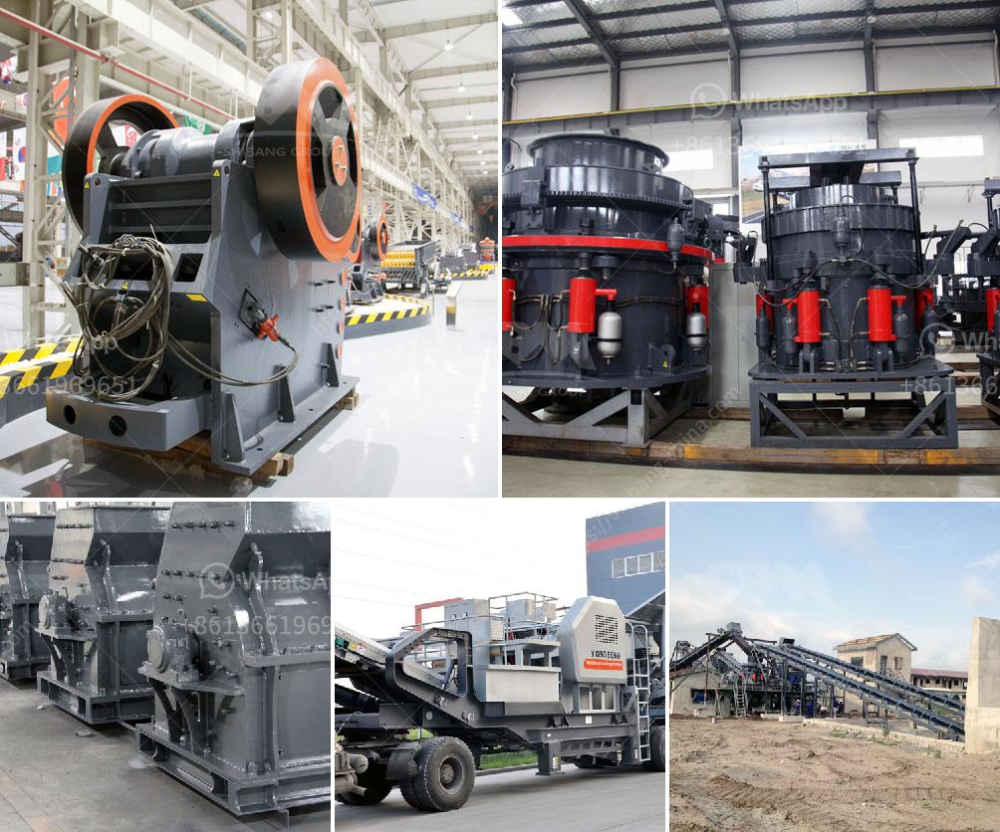

<h3>quarry rock crusher</h3>
The quarry rock crusher is widely used in mining and quarrying industry around the world. In the past, the quarry rock crusher was commonly used for coarse, medium, and fine crushing of rocks and minerals. With the advent of new technology and its application in the mining industry, the quarry rock crusher has been used extensively for crushing and grinding purposes.

The quarry rock crusher is specifically used for processing ores and rocks of a grade higher than medium hardness, and the final product size can be adjusted within a certain range according to different requirements. The quarry rock crusher mainly consists of jaw crusher, impact crusher, cone crusher, hammer crusher, and VSI crusher, etc.

In recent years, the rock crusher market has been prosperous with several new players entering the industry. The competition among them is fierce, leading to their constant innovation and development. As a result, the quarry rock crusher has become more and more efficient to ensure the stable and reliable operation of mining machinery.

One of the key advantages of the quarry rock crusher is its excellent performance. It is especially suitable for crushing various hard and brittle materials, such as granite, basalt, iron ore, river pebbles, limestone, etc. The quarry rock crusher has been widely used in the industries of mining, metallurgy, building materials, highway, railway, water conservancy, and chemical engineering.

Another benefit of the quarry rock crusher is its ability to work in a wide range of different environments. It can withstand various harsh conditions, such as high temperature, high humidity, and high altitude. This makes the quarry rock crusher suitable for use in remote areas, such as deserts and mountains, where the infrastructure and transportation are limited.

Moreover, the quarry rock crusher is equipped with a variety of safety and environmental protection devices, such as dust removal and noise reduction systems. This ensures the health and safety of the operators and reduces the impact of noise and dust on the surroundings. As a result, the quarry rock crusher has become more and more popular among both mining companies and local communities.

Furthermore, the quarry rock crusher is easy to maintain. Its wear-resistant parts can be replaced and repaired conveniently, which reduces the downtime and extends the service life of the equipment. This results in lower maintenance costs and higher productivity, making it a cost-effective choice for mining and quarrying operations.

In conclusion, the quarry rock crusher plays a significant role in the mining and quarrying industry. Its excellent performance, versatility, and easy maintenance make it a preferred choice for both mining companies and local communities. With continuous innovation and development, the quarry rock crusher will continue to contribute to the sustainable and efficient operation of mining machinery.
<h3>Contact us</h3><ul><li><strong>Whatsapp:&nbsp;<a href="https://wa.me/8613661969651">+8613661969651</a></strong></li><li><a href="https://swt.shibang-china.com/?git&amp;zhl&amp;quarry rock crusher"><strong>Online Service(chat now)</strong></a></li></ul><h3>Related</h3><ul><li><a href='ball mill specification.md'>ball mill specification</a></li><li><a href='barite mining equipment.md'>barite mining equipment</a></li><li><a href='types of stone crushing plant pdf.md'>types of stone crushing plant pdf</a></li><li><a href='calculate costs of crushing limestone.md'>calculate costs of crushing limestone</a></li><li><a href='mobile gold processing plant with price.md'>mobile gold processing plant with price</a></li></ul>