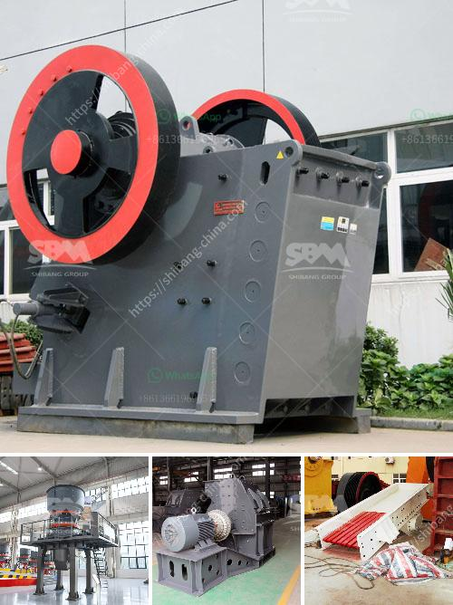

<h3>quarrying crusher equipment</h3>
Quarrying, the process of extracting rocks and other materials from the earth's surface, has been in practice for centuries. Today, quarrying activities involve different crushing techniques to obtain the desired product sizes.

Quarrying crusher equipment mainly includes jaw crusher, impact crusher, cone crusher, mobile crusher, and various other types. These equipment have different functions. Jaw crusher is mainly used for the primary crushing process. Cone crusher or impact crusher is the secondary crushing machines. VSI crusher majors on the tertiary crushing stage.

Choosing the right crusher equipment for quarrying operations can greatly boost productivity and efficiency. A primary crusher, such as a jaw crusher, is used to reduce ore into particles less than 150 millimeters in diameter. Impact crusher and cone crushers are commonly used for secondary crushing operations. The final product is sized according to customer's requirements.

Many factors contribute to the selection of those equipment, including the characteristics of the raw material, site conditions, desired product quality, and capacity requirements. It is crucial to consider these factors to ensure that the chosen crusher equipment can handle the material and provide the desired output.

To further improve the efficiency of crusher equipment, advanced technologies have been integrated. For example, some crushers are equipped with automatic technologies that adjust the gap between the jaws or cones to control the product's size. Other features, such as remote control operation and monitoring systems, provide ease of use and enhance safety.

Not only does quarrying crusher equipment help extract materials efficiently, but it also plays a vital role in sustaining the construction industry's growth. With the continuous demand for aggregates, the use of reliable and efficient crushers ensures a steady supply of materials for construction projects.

In conclusion, quarrying crusher equipment is essential in the quarrying industry. It facilitates the extraction of valuable minerals and materials from the earth's surface while delivering the desired product sizes. The availability of advanced technologies enhances productivity and makes the process more efficient. Furthermore, these crushers play a crucial role in the growth and sustainability of the construction industry.
<h3>Contact us</h3><ul><li><strong>Whatsapp:&nbsp;<a href="https://wa.me/8613661969651">+8613661969651</a></strong></li><li><a href="https://swt.shibang-china.com/?git&amp;zhl&amp;quarrying crusher equipment"><strong>Online Service(chat now)</strong></a></li></ul><h3>Related</h3><ul><li><a href='basalt production machinery.md'>basalt production machinery</a></li><li><a href='stone crushing plant project report doc.md'>stone crushing plant project report doc</a></li><li><a href='vertical mill china.md'>vertical mill china</a></li><li><a href='stone crushing machines in canada.md'>stone crushing machines in canada</a></li><li><a href='6inch rock crushing mill in guatemala.md'>6inch rock crushing mill in guatemala</a></li></ul>