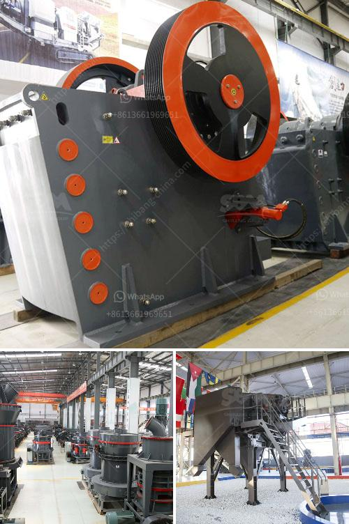

<h3>quartz crushing machine cost</h3>
Quartz is a mineral that can be found in abundance in the Earth's crust. It is often used in various industrial applications due to its physical and chemical properties. One of the most commonly used methods to extract quartz from the earth is through the process of crushing. A quartz crushing machine is essential in this process, as it reduces the raw quartz to a more manageable size.

The cost of quartz crushing machines can vary widely depending on the size and configuration of the machine. For instance, a large, stationary machine that crushes quartz into 2-3-inch particles may cost anywhere from $500,000 to $2 million. Smaller machines that can crush 1-2-inch quartz particles to sand size generally cost around $100,000 to $500,000.

The main factors that influence the cost of a quartz crushing machine include the capacity, power requirements, and the level of automation. Machines with higher capacities tend to have higher costs, as they require more robust construction and additional components to handle the increased workload.

Similarly, machines that require higher power consumption, such as those with larger motors, may also have higher costs. However, higher power consumption may be offset by increased productivity, efficiency, and reduced maintenance costs.

Automation is another factor that can influence the cost of a quartz crushing machine. More automated machines typically have higher upfront costs, but they can significantly reduce labor requirements and increase productivity in the long run.

It is important to note that the cost of a quartz crushing machine is just one aspect to consider when investing in such equipment. Other factors such as reliability, maintenance requirements, and after-sales support should also be taken into account.

In conclusion, the cost of a quartz crushing machine can vary depending on various factors such as capacity, power requirements, and automation level. It is crucial to assess your specific needs and budget to choose the most suitable machine for your quartz crushing operation. Investing in a high-quality and efficient machine can lead to increased productivity and cost savings in the long term.
<h3>Contact us</h3><ul><li><strong>Whatsapp:&nbsp;<a href="https://wa.me/8613661969651">+8613661969651</a></strong></li><li><a href="https://swt.shibang-china.com/?git&amp;zhl&amp;quartz crushing machine cost"><strong>Online Service(chat now)</strong></a></li></ul><h3>Related</h3><ul><li><a href='jaw crusher animation.md'>jaw crusher animation</a></li><li><a href='rock grinding equipment for sale in texas.md'>rock grinding equipment for sale in texas</a></li><li><a href='how to crush granite to powder.md'>how to crush granite to powder</a></li><li><a href='how much cost to build a 50 ton cement plant.md'>how much cost to build a 50 ton cement plant</a></li><li><a href='hammer mill of 1 ton per hour.md'>hammer mill of 1 ton per hour</a></li></ul>