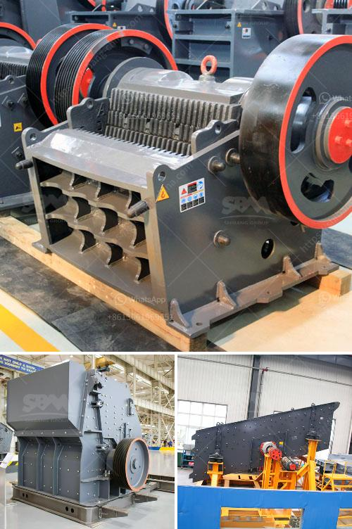

<h3>quartz plant machinery suppliers in china</h3>
Quartz is a versatile mineral used in various industries such as construction, electronics, and jewelry. As the demand for quartz products continues to rise, the need for reliable machinery suppliers becomes crucial. China, known for its strong manufacturing industry, has emerged as a hub for quartz plant machinery suppliers.

China is the largest producer of quartz worldwide, and it boasts a vast network of suppliers that provide machinery for quartz processing plants. These suppliers offer a wide range of machinery, including crushers, pulverizers, screeners, and grinders, suitable for different stages of the quartz production process.

One prominent supplier in China's quartz machinery industry is ABC Machinery. With years of experience and expertise in manufacturing machinery for quartz processing, ABC Machinery has established itself as a reliable player in the market. They provide a comprehensive range of machinery, from initial quartz crushing to the final grinding and polishing stages.

The quartz crushing process involves reducing the raw quartz material into smaller, more manageable pieces. Crushers play a vital role in this stage by breaking down the quartz into smaller fragments. ABC Machinery offers a variety of crushers, including jaw crushers, impact crushers, and cone crushers, designed to handle the different characteristics of quartz.

After the quartz is crushed, pulverizers are used to further reduce its particle size. Pulverizers are capable of producing a fine powder from the crushed quartz, which is essential for the next processing steps. ABC Machinery offers different types of pulverizers, such as Raymond mills and ball mills, to meet the diverse needs of their clients.

Screeners are another crucial part of the quartz processing plant machinery. They are used to separate the crushed and pulverized quartz particles into different sizes. Screeners ensure that only the desired particle size is retained for further processing. ABC Machinery supplies various types of screeners, such as vibrating screens and rotary screens, to achieve efficient and accurate screening results.

Grinders are the final stage in the quartz processing plant, responsible for refining the quartz powder into a smooth and flawless product. ABC Machinery offers cutting-edge grinding machines that ensure high precision and excellent surface finish for the final quartz powder. These grinders are equipped with advanced technology to achieve the desired particle size and shape.

In addition to ABC Machinery, there are several other quartz plant machinery suppliers in China. These suppliers compete in the market by offering a diverse range of machinery, customized solutions, and excellent after-sales service. They cater to the specific needs of their clients, helping them set up efficient and cost-effective quartz processing plants.

China's quartz plant machinery suppliers have played a significant role in meeting the growing global demand for quartz products. Their machinery has enabled manufacturers to process quartz efficiently, resulting in high-quality products that meet the industry's stringent standards.

With China's continuous advancements in manufacturing technology and a strong supply chain, it is expected that the country will remain a major player in the market for quartz plant machinery. The reliable and innovative machinery supplied by Chinese manufacturers contributes to the overall growth and success of the quartz industry worldwide.
<h3>Contact us</h3><ul><li><strong>Whatsapp:&nbsp;<a href="https://wa.me/8613661969651">+8613661969651</a></strong></li><li><a href="https://swt.shibang-china.com/?git&amp;zhl&amp;quartz plant machinery suppliers in china"><strong>Online Service(chat now)</strong></a></li></ul><h3>Related</h3><ul><li><a href='portable home gold processing machine.md'>portable home gold processing machine</a></li><li><a href='how to start stone crushing business in kenya.md'>how to start stone crushing business in kenya</a></li><li><a href='ceramic ball mill.md'>ceramic ball mill</a></li><li><a href='talcum powder making formulation.md'>talcum powder making formulation</a></li><li><a href='used sand washing machine for sale.md'>used sand washing machine for sale</a></li></ul>