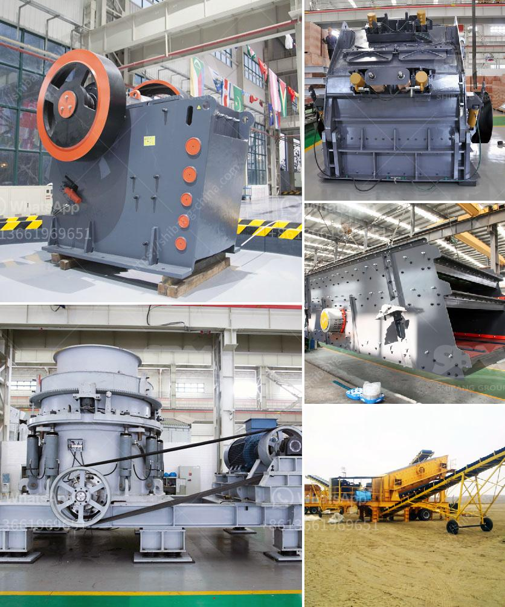

<h3>quartz plants in india</h3>
India is blessed with a rich variety of natural resources that have been a driving force behind its economic growth and development. One such resource that plays a pivotal role in India's industrial sector is quartz. With its unique properties and widespread applications, quartz has become an integral part of several industries, including glass manufacturing, ceramics, refractories, and construction. This has led to the establishment of numerous quartz plants across the country, further enhancing its significance as a major player in the global quartz market.

Quartz, also known as silicon dioxide, is a mineral composed of silicon and oxygen atoms. It is the second most abundant mineral on Earth's crust and is found in various forms, including crystalline, amorphous, and cryptocrystalline. However, the crystalline form of quartz, known as high-purity or engineered quartz, is highly sought after due to its exceptional physical and chemical properties.

In India, the state of Rajasthan is a major hub for quartz plants due to its abundant reserves of quartz-rich deposits. These plants extract, process, and refine quartz to meet the diverse requirements of different industries. The production process involves crushing and grinding the raw quartz to obtain the desired particle size. It is then washed and purified to remove impurities, ensuring a high level of purity.

The demand for quartz in India and globally has witnessed significant growth in recent years. Its superior hardness, resistance to chemical corrosion, and high melting point make it an ideal material for the production of glass. In the glass industry, quartz is used as a key ingredient in the manufacturing of glass containers, fiberglass, and specialty glass products. The exceptional thermal and mechanical properties of quartz also make it indispensable in the refractory industry, where it is employed in the production of linings for furnaces and kilns.

Furthermore, quartz's resistance to high temperatures and its low thermal expansion coefficient have made it an important component in the production of ceramics. It enhances the strength and durability of ceramic products, making them suitable for various applications, such as tiles, sanitaryware, and electrical insulators. Additionally, the construction industry relies on quartz in the form of quartz sand for the production of concrete, where it acts as a filler and improves the workability of the mixture.

The growth of quartz plants in India has not only contributed to the country's industrial development but has also created employment opportunities for many. These plants employ skilled workers who are involved in various stages of the production process, ensuring quality and consistency. Moreover, the establishment of quartz plants has further spurred the development of ancillary industries, such as transportation, logistics, and equipment manufacturing.

While India has been a major player in the quartz market, it faces competition from other countries such as China, the United States, and Russia. To maintain its position and capitalize on the growing demand, investment in research and development is crucial. Focus should be directed towards enhancing the productivity and efficiency of quartz plants by implementing advanced technologies and exploring innovative methods of extraction and processing.

In conclusion, quartz plants in India have emerged as significant players in the global quartz market. The availability of rich quartz reserves, coupled with its diverse applications, has catalyzed the growth of this industry. Quartz not only contributes to various sectors but also acts as a pillar supporting India's economic growth and development. With continued investment and focus on technological advancements, the future of quartz plants in India looks promising, ensuring their sustainable contribution to the nation's industrial landscape.
<h3>Contact us</h3><ul><li><strong>Whatsapp:&nbsp;<a href="https://wa.me/8613661969651">+8613661969651</a></strong></li><li><a href="https://swt.shibang-china.com/?git&amp;zhl&amp;quartz plants in india"><strong>Online Service(chat now)</strong></a></li></ul><h3>Related</h3><ul><li><a href='jaw crusher for sale china.md'>jaw crusher for sale china</a></li><li><a href='cement clinker grinding and packing plant.md'>cement clinker grinding and packing plant</a></li><li><a href='limestone crusher philippines.md'>limestone crusher philippines</a></li><li><a href='types of diaphragm in ball mill.md'>types of diaphragm in ball mill</a></li><li><a href='rock crushing plant 100tph.md'>rock crushing plant 100tph</a></li></ul>