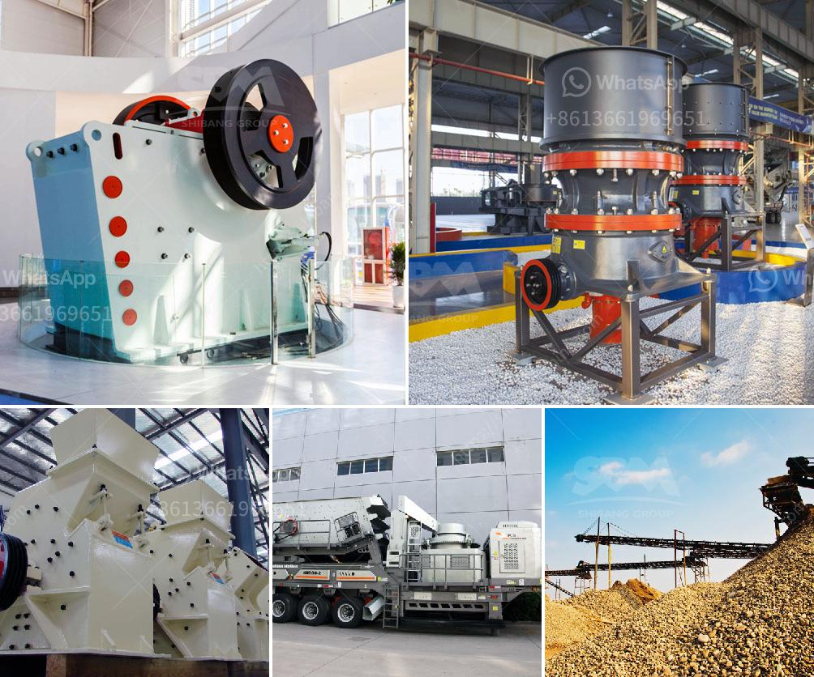

<h3>quartz powder manufacturers manufacturers in china</h3>
China is one of the leading manufacturing hubs for various products across different industries and sectors. When it comes to quartz powder, China stands out as one of the major producers and exporters in the global market. The country's rich mineral resources, advanced manufacturing technology, and competitive pricing make it an attractive destination for international buyers.

Quartz powder, also known as silica powder, is a key raw material used in various industries including ceramics, glass, electronics, chemicals, and paints. It is derived from quartz, a mineral that is abundantly found in China. The quartz powder manufacturing process involves crushing, grinding, and purifying quartz stones to obtain the desired product.

China boasts a large number of quartz powder manufacturers, spread across different provinces and regions. These manufacturers operate both large-scale production facilities and small-scale units, catering to different customer requirements. The quartz powder produced in China meets international quality standards due to the stringent quality control measures implemented by manufacturers.

One of the reasons why China is a preferred destination for quartz powder manufacturing is its advanced technology and machinery. Chinese manufacturers have invested heavily in state-of-the-art equipment, which enables them to produce high-quality quartz powder efficiently and in large quantities. As a result, they are able to meet the growing demand from industries worldwide.

Moreover, China offers a competitive advantage in terms of pricing. Due to economies of scale and lower production costs, Chinese manufacturers are able to offer quartz powder at a more affordable price compared to other countries. This cost advantage makes China a popular choice for buyers looking for competitive pricing without compromising on quality.

In addition to high-quality products and competitive pricing, Chinese manufacturers also provide excellent customer service and after-sales support. They have well-established distribution networks, ensuring prompt and reliable delivery of quartz powder to customers across the globe. Chinese manufacturers also prioritize customer satisfaction by offering customized solutions and addressing any queries or concerns promptly.

However, like any industry, there are some challenges that quartz powder manufacturers in China face. Environmental regulations have become more stringent in recent years, leading to increased focus on sustainable and eco-friendly manufacturing practices. Manufacturers are now adopting measures to minimize their environmental impact and promote sustainable development.

Furthermore, the competition within the quartz powder manufacturing industry has also intensified. As China remains a major player in the global market, manufacturers constantly strive to differentiate themselves by improving product quality, exploring new applications for quartz powder, and investing in research and development.

In conclusion, China's quartz powder manufacturers have established themselves as key players in the global market. Their advanced technology, competitive pricing, and emphasis on quality have made them a preferred choice for international buyers. With a strong commitment to customer service and environmental sustainability, Chinese manufacturers are well-positioned to meet the growing demand for quartz powder in various industries.
<h3>Contact us</h3><ul><li><strong>Whatsapp:&nbsp;<a href="https://wa.me/8613661969651">+8613661969651</a></strong></li><li><a href="https://swt.shibang-china.com/?git&amp;zhl&amp;quartz powder manufacturers manufacturers in china"><strong>Online Service(chat now)</strong></a></li></ul><h3>Related</h3><ul><li><a href='mobile crusher capacity 200 ton per hour.md'>mobile crusher capacity 200 ton per hour</a></li><li><a href='china cone crusher.md'>china cone crusher</a></li><li><a href='wet grinding of mica process and equipment.md'>wet grinding of mica process and equipment</a></li><li><a href='granite crusher price list.md'>granite crusher price list</a></li><li><a href='limestone fine grind plant for sale.md'>limestone fine grind plant for sale</a></li></ul>