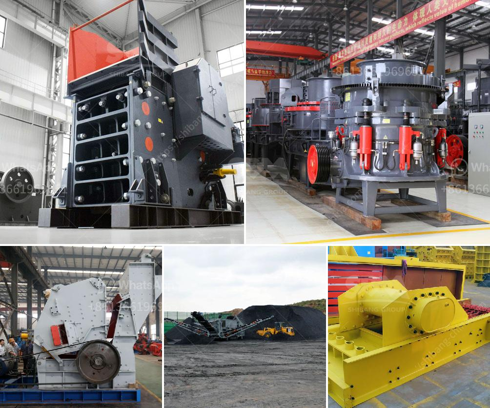

<h3>quartz powder manufacturing equipments</h3>
Quartz powder manufacturing equipments are essential for producing quartz powder, which is popular in various industries such as glass, ceramics, and construction. These equipments are used to grind, crush, and grind quartz into fine particles to achieve the desired particle size and quality.

One key equipment used in the manufacturing process is a quartz crushing machine. It is used to crush the quartz into smaller sizes suitable for further processing. The machine consists of a heavy-duty steel frame and a crushing chamber with a high-speed rotor. The rotor strikes the quartz material, breaking it into smaller particles. This process ensures that the final product has the desired particle size and consistency.

After crushing, the quartz particles are then grinded using a grinding mill. The grinding mill is equipped with a rotating grinding disc, which grinds the quartz particles into a fine powder. The rotation of the disc creates a shearing and impacting action, reducing the quartz particles to the desired fineness. The grinding mill can be made of various materials depending on the specific requirements of the manufacturing process.

In addition to the crushing and grinding equipment, other essential equipments in the quartz powder manufacturing process include vibrating screens, air classifiers, and magnetic separators. Vibrating screens are used to separate the quartz particles based on their size. Air classifiers help in separating the fine particles from the coarse particles, ensuring the quality of the final product. Magnetic separators are utilized to remove any impurities or magnetic materials present in the quartz powder.

Overall, quartz powder manufacturing equipments play a vital role in producing high-quality quartz powder with the desired properties. These equipments are designed to efficiently convert raw quartz into a fine powder that meets the industry standards. With advancements in technology, these equipments are continually being updated and improved to enhance productivity and quality in the manufacturing process.
<h3>Contact us</h3><ul><li><strong>Whatsapp:&nbsp;<a href="https://wa.me/8613661969651">+8613661969651</a></strong></li><li><a href="https://swt.shibang-china.com/?git&amp;zhl&amp;quartz powder manufacturing equipments"><strong>Online Service(chat now)</strong></a></li></ul><h3>Related</h3><ul><li><a href='stone crusher sample business plan.md'>stone crusher sample business plan</a></li><li><a href='granite stone processing plant.md'>granite stone processing plant</a></li><li><a href='used crusher stone sale tanzania.md'>used crusher stone sale tanzania</a></li><li><a href='cost per tonne crushing iron ore.md'>cost per tonne crushing iron ore</a></li><li><a href='coal crushing machine in east rand.md'>coal crushing machine in east rand</a></li></ul>