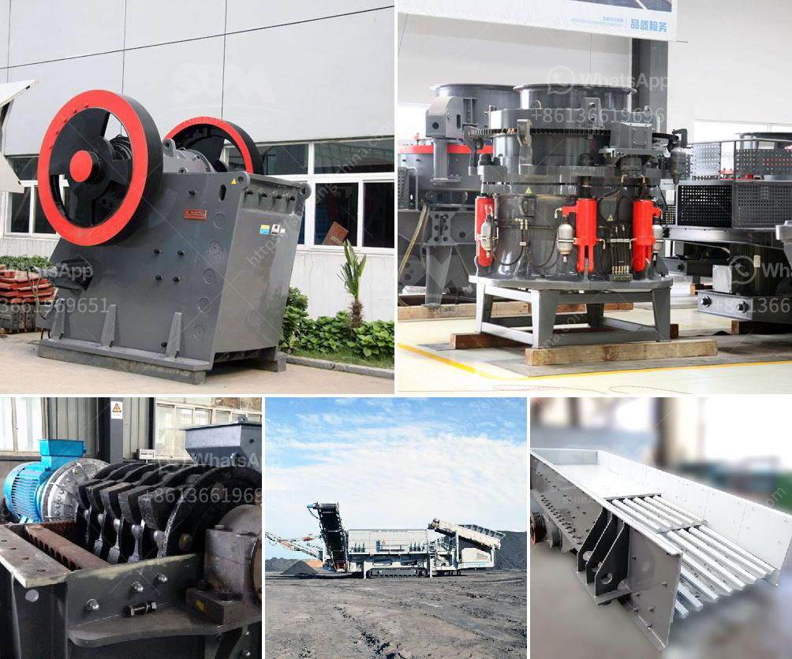

<h3>quartz powder manufacturing process</h3>
Quartz powder manufacturing is a complex process that involves various steps, starting from the selection of raw materials, crushing, grinding, and blending, to the formation of the finished product. With the growing demand for quartz powder in various industries, the manufacturing process has become more refined over the years, resulting in a high-quality final product.

The first step in the quartz powder manufacturing process is the selection of raw materials. High-quality quartz crystals are sourced from mines or obtained as by-products from other industries. These raw materials are then carefully sorted and inspected to ensure their purity and consistency. Impurities, such as iron oxides and organic matter, can affect the quality and color of the final product, so they need to be removed during this stage.

After the selection of raw materials, the next step is the crushing process. Large quartz crystals are crushed into smaller particles using crushers or grinding mills. This stage helps in reducing the size of the crystals and preparing them for further processing.

The crushed quartz particles are then ground into a fine powder in grinding mills. The grinding process ensures the uniformity and smooth texture of the powder, contributing to its quality and usability. Different types of mills, such as ball mills and vertical mills, are used in this stage, depending on the desired particle size and application requirements. The ground quartz powder is then classified using specialized equipment to separate particles of different sizes and remove any remaining impurities.

Once the powder is properly ground and classified, it goes through a blending process. During this stage, various additives may be introduced to enhance the properties of the final product. For example, additives like resins or pigments can be added to improve the powder's flowability or give it a specific color. The blending process ensures that these additives are evenly distributed throughout the powder, creating a homogenous mixture.

The final stage of the quartz powder manufacturing process is the formation of the finished product. The blended powder is compacted in molds or pressed into desired shapes using hydraulic or mechanical presses. The compacted powder is then sintered at high temperatures in kilns or ovens to further enhance its strength and stability. The sintering process helps in fusing the powder particles together, resulting in a solid and durable final product.

Once the sintering process is complete, the quartz powder is cooled and inspected for any defects or irregularities. Depending on the desired application, additional finishing processes may be carried out, such as polishing or coating, to enhance the appearance and performance of the final product.

In conclusion, the quartz powder manufacturing process involves several crucial steps, from the selection of high-quality raw materials to the formation of the finished product. Each stage requires careful attention to detail and the use of specialized equipment to ensure the production of a high-quality and consistent quartz powder. With the advancements in technology, the manufacturing process continues to evolve, resulting in improved efficiency and a wider range of applications for quartz powder in industries such as ceramics, glass, and electronics.
<h3>Contact us</h3><ul><li><strong>Whatsapp:&nbsp;<a href="https://wa.me/8613661969651">+8613661969651</a></strong></li><li><a href="https://swt.shibang-china.com/?git&amp;zhl&amp;quartz powder manufacturing process"><strong>Online Service(chat now)</strong></a></li></ul><h3>Related</h3><ul><li><a href='composetion of terracotta tiles.md'>composetion of terracotta tiles</a></li><li><a href='hot selling coal mine roller crushing plant in india.md'>hot selling coal mine roller crushing plant in india</a></li><li><a href='cost in india of 100 ton mobile limestone crusher.md'>cost in india of 100 ton mobile limestone crusher</a></li><li><a href='hammer mill edipesa.md'>hammer mill edipesa</a></li><li><a href='gypsum recycling equipment for sale.md'>gypsum recycling equipment for sale</a></li></ul>