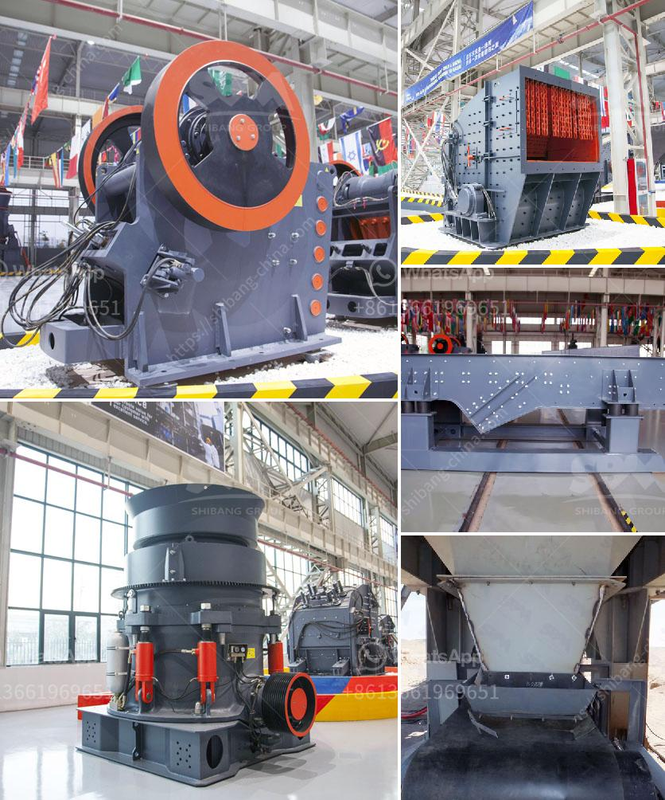

<h3>quartz silica crushing unit</h3>
Quartz silica, commonly known as quartz sand or silica sand, is a type of crystalline silica found in abundance in the Earth's crust. It is one of the most common minerals on the planet and is used in various industries for numerous applications due to its high resistance to weathering and chemical corrosion.

One of the most common uses of quartz silica is as raw material for producing glass. The silica content in quartz sand gives glass its transparent and durable properties. The glass industry requires high-quality quartz sand that is free from impurities, such as iron oxides and other contaminants. Hence, the need for processing and crushing units that can produce quartz silica of desired purity and particle sizes.

A quartz silica crushing unit consists of crushers and grinding mills. The main purpose of a crushing unit is to break the rock into smaller sizes that can be processed further for various industrial applications. Quartz silica crushing units are available in various sizes and configurations to meet the specific needs of different industries.

Nowadays, market demands for quartz silica sand are rising. Many investors have invested in quartz silica crushing unit to produce high-quality sand and aggregate products for construction projects. Crushing units can be custom-built based on the specific requirements of clients, such as input size, output size, capacity, and the hardness of the rock being crushed.

The crushing process can be divided into three stages: primary crushing, secondary crushing, and tertiary crushing. In the primary crushing stage, jaw crushers or gyratory crushers are commonly used to reduce the size of the rocks. Cone crushers or impact crushers are used for secondary crushing to achieve further reduction in size. Finally, the crushed material is sent to a vibrating screen, where it is separated into different size fractions. Oversized materials are sent back to the crushers for further crushing, while the desired size fractions are collected as the final product.

In addition to crushing, grinding mills are used to further process the crushed quartz silica into finer particles. Ball mills or rod mills are commonly used for grinding. The ground material is then classified by a classifier to separate the desired particle size.

Crushing units for quartz silica are often equipped with dust control systems to minimize the release of harmful dust particles. Respiratory protective equipment is also recommended for workers involved in the crushing process to ensure their safety and health.

In conclusion, quartz silica crushing units play a crucial role in the production of high-quality silica sand and aggregate for various industrial applications. With the increasing demand for these materials, investing in a well-designed and efficient crushing unit can be a profitable business opportunity. Additionally, proper safety measures should be implemented to protect workers and minimize the environmental impact of the crushing process.
<h3>Contact us</h3><ul><li><strong>Whatsapp:&nbsp;<a href="https://wa.me/8613661969651">+8613661969651</a></strong></li><li><a href="https://swt.shibang-china.com/?git&amp;zhl&amp;quartz silica crushing unit"><strong>Online Service(chat now)</strong></a></li></ul><h3>Related</h3><ul><li><a href='mobile crusher capacity 200 ton per hour.md'>mobile crusher capacity 200 ton per hour</a></li><li><a href='raymond mill from china best supplier on sale.md'>raymond mill from china best supplier on sale</a></li><li><a href='jaw crusher 24x36.md'>jaw crusher 24x36</a></li><li><a href='lime processing plant hammer mill.md'>lime processing plant hammer mill</a></li><li><a href='bentonite production plant machinery.md'>bentonite production plant machinery</a></li></ul>