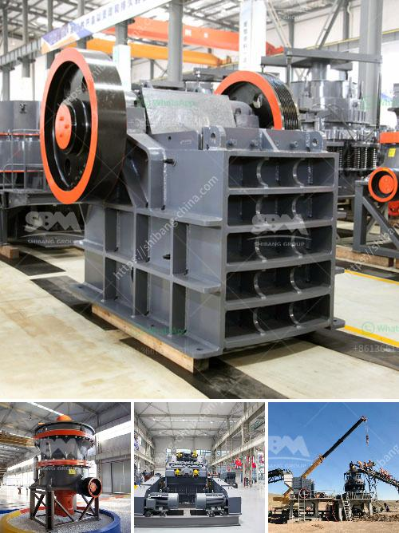

<h3>quartz stone crusher application</h3>
Quartz stone is a hard and durable material that is used in various industries for numerous purposes. It is a common ingredient in countertops, floorings, and wall coverings. With its unique properties, quartz stone can be crushed and processed into different sizes for various applications.

One of the key applications of quartz stone is in the mining industry. Quartz stone crushers are used to crush stones into smaller particles for construction purposes in quarries. It is essential to choose the right quartz crusher for different applications, as quartz stone can be used in different industries, such as building materials, ceramics, and glass.

The quartz crushing process involves multiple stages, including crushing, grinding, screening, and classifying. First, quartz stones are sent to jaw crusher for coarse crushing, then screened by vibrating screen for further processing. The next step is grinding, usually with ball mills. This helps to obtain fine quartz particles with high purity. Finally, the crushed quartz particles are classified by a classifier or cyclone separator.

1. Mining industry: Quartz stone is often used as raw material for producing construction materials, such as durability stones, and artificial sand. Quartz stone crusher is mainly used for crushing stones to build durable and visually pleasing buildings.

2. Highway construction: Quartz sand is used in the production of concrete for road construction. It enhances the strength and durability of the pavement. Quartz stone crushers are essential in the process of producing concrete mixtures to ensure the quality of the final products.

3. Ceramic industry: Ceramic materials, such as tiles, sanitary ware, and tableware, often require high-quality quartz sand as a raw material. Quartz stone crushers can help achieve required specifications for ceramic production.

4. Glass manufacturing: Glass is made by melting silica-based raw materials, such as quartz, at high temperatures. Quartz stone crushers are used to crush the raw materials to produce desirable glass products.

5. Metallurgical industry: Quartz stone crushers are mainly used for crushing quartz stone materials. The bulk quartz stones are crushed into the required particle size, and then used as raw materials for various metallurgical industries.

Quartz stone crusher is a versatile machine that can be used in various industries. It can crush, grind, and process different quartz materials. With the increasing demand for high-quality quartz materials, it is crucial to choose the right quartz crusher to achieve your desired results and maximize productivity. Whether it is for mining, highway construction, ceramics, glass manufacturing, or metallurgical industries, a quartz stone crusher plays a vital role in meeting your needs.
<h3>Contact us</h3><ul><li><strong>Whatsapp:&nbsp;<a href="https://wa.me/8613661969651">+8613661969651</a></strong></li><li><a href="https://swt.shibang-china.com/?git&amp;zhl&amp;quartz stone crusher application"><strong>Online Service(chat now)</strong></a></li></ul><h3>Related</h3><ul><li><a href='grinding units of feldspar.md'>grinding units of feldspar</a></li><li><a href='cement grinding station quotations.md'>cement grinding station quotations</a></li><li><a href='quartz crushing machine cost.md'>quartz crushing machine cost</a></li><li><a href='mobile dimension stone processing.md'>mobile dimension stone processing</a></li><li><a href='one ton per hour crushing mill.md'>one ton per hour crushing mill</a></li></ul>