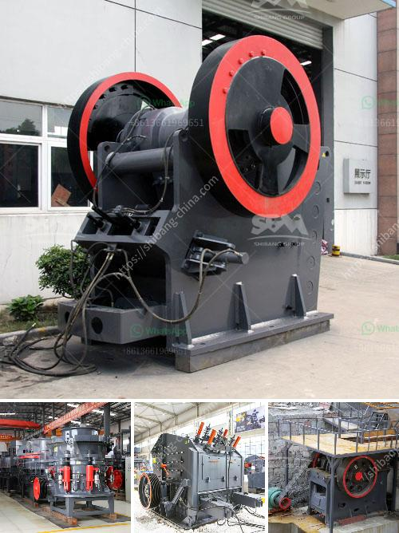

<h3>quartz stone crusher plants made in turkey</h3>
Quartz stone is mined from the earth and shaped into different sizes and shapes to meet various construction requirements. With its robust composition and aesthetic appeal, quartz stone has become a popular choice for countertops, flooring, and other surfaces in both residential and commercial settings.

Turkey, known for its rich natural stone resources, has emerged as a leading producer and exporter of quartz stone products. The country boasts state-of-the-art production facilities and cutting-edge technology that allow for the efficient extraction and processing of quartz stone.

Quartz stone crusher plants are built to maximize the production capacity of quartz stones in Turkey. These plants make use of advanced crushing and screening technology to ensure high productivity and uniformity in the final products. These plants also come with advanced dust and noise reduction features to address environmental concerns.

The quartz stone crusher plants are carefully designed to meet the various requirements of the quarrying and construction industries. Each plant is designed with optimum feeding, crushing, and screening performance in mind. Additionally, each plant is available in a variety of sizes and configurations to suit specific site conditions and production requirements.

The versatility and durability of quartz stone make it a suitable material for a wide range of applications. Its resistance to heat, scratches, and stains make it an excellent choice for kitchen countertops, while its natural beauty and abundance of colors make it suitable for both indoor and outdoor flooring. These qualities, coupled with its easy maintenance and excellent longevity, make quartz stone an ideal choice for many homeowners and architects.

In conclusion, quartz stone crusher plants are essential for the efficient production of quartz stones in Turkey. With their state-of-the-art technology and high-performance machinery, these plants are bound to increase productivity and boost revenue in the quartz stone industry.
<h3>Contact us</h3><ul><li><strong>Whatsapp:&nbsp;<a href="https://wa.me/8613661969651">+8613661969651</a></strong></li><li><a href="https://swt.shibang-china.com/?git&amp;zhl&amp;quartz stone crusher plants made in turkey"><strong>Online Service(chat now)</strong></a></li></ul><h3>Related</h3><ul><li><a href='micro powder grinder mill.md'>micro powder grinder mill</a></li><li><a href='how much cost to establish stone crusher south africa.md'>how much cost to establish stone crusher south africa</a></li><li><a href='vertical mill china.md'>vertical mill china</a></li><li><a href='vertical conveyor for gravel transporting.md'>vertical conveyor for gravel transporting</a></li><li><a href='dolomite crushing plant in bharuch.md'>dolomite crushing plant in bharuch</a></li></ul>