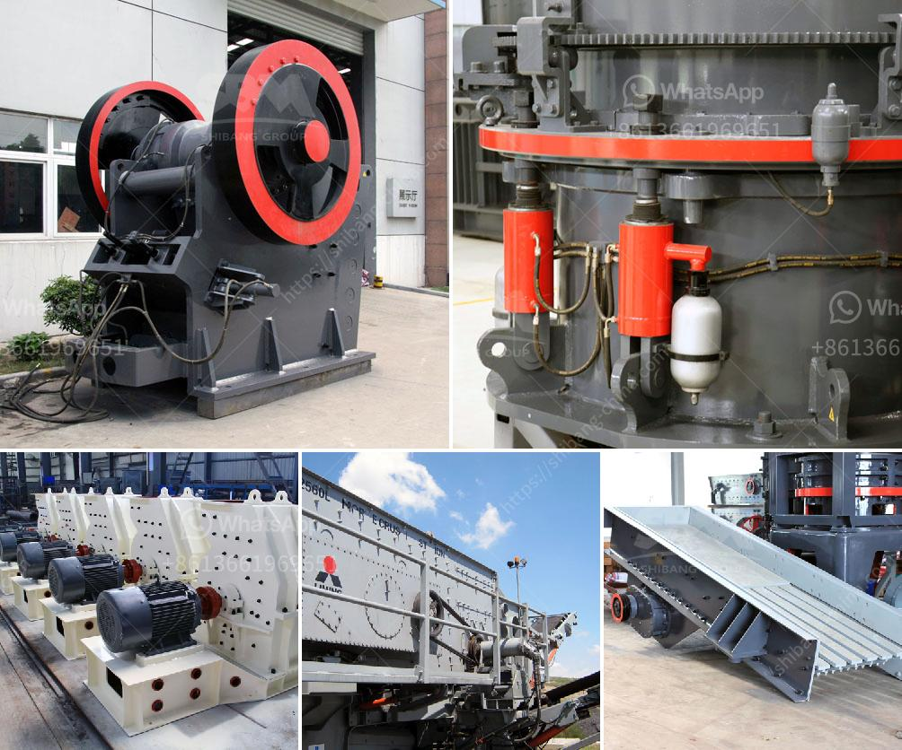

<h3>quartz stone manufacturing plant</h3>
Quartz stone manufacturing plants are becoming a popular choice for discerning architects, designers, and homeowners due to their durability, versatility, and aesthetic appeal. In fact, the demand for quartz stone has been growing consistently over the years, leading to the establishment of numerous manufacturing plants worldwide.

Quartz stone is a composite material made from a combination of quartz crystals, resins, and pigments. This engineered stone not only replicates the natural beauty of granite and marble but also offers enhanced durability and functionality. It is highly resistant to heat, stains, scratches, and impact, making it an ideal choice for various applications in the construction and interior design sectors.

A quartz stone manufacturing plant typically includes several processes, starting with the extraction and processing of quartz crystals from mines or quarries. Afterward, the quartz crystals are crushed and ground into fine particles. These particles are then mixed with resin and pigments to form slabs, which are later cured in special industrial ovens.

The manufacturing plant houses advanced machinery and equipment, including crushers, vibrating screens, mixers, and vacuum presses, which ensure the precision and quality of the final product. Specialized machines are employed for cutting, polishing, and finishing the quartz stone slabs, giving them a smooth and glossy surface.

The production capacity of a quartz stone manufacturing plant can vary depending on its size and technology, but it is typically capable of producing thousands of square meters of quartz stone slabs per month. The wide range of colors, patterns, and textures available makes quartz stone a versatile material for various applications, including kitchen countertops, bathroom vanities, flooring, wall cladding, and furniture.

One of the key advantages of quartz stone manufacturing plants is their ability to produce consistently high-quality products. The process is carefully controlled and monitored to ensure uniformity in color, texture, and thickness throughout each slab. This level of precision allows for easy installation and seamlessness in large projects, eliminating the need for matching and sorting slabs.

Additionally, quartz stone's non-porous nature makes it highly resistant to staining, providing a hygienic and low-maintenance surface. It is also resistant to heat, allowing for direct contact with hot pots and pans without the risk of damage. The durability of quartz stone ensures that it retains its vibrant colors and luster for years, making it a long-term investment that adds value to any space.

From an environmental standpoint, quartz stone manufacturing plants are committed to sustainability. They utilize water recycling systems to minimize water consumption during production and adopt eco-friendly practices to reduce waste and emissions. Furthermore, the durability and longevity of quartz stone prevent the need for frequent replacements, contributing to the conservation of natural resources.

As the popularity of quartz stone continues to grow, so does the number of manufacturing plants. These plants are not only revolutionizing the construction and interior design industry but also providing job opportunities and boosting the economy. With their precise craftsmanship, durability, aesthetic appeal, and commitment to sustainability, quartz stone manufacturing plants are indeed a blossoming industry that shows no signs of slowing down.
<h3>Contact us</h3><ul><li><strong>Whatsapp:&nbsp;<a href="https://wa.me/8613661969651">+8613661969651</a></strong></li><li><a href="https://swt.shibang-china.com/?git&amp;zhl&amp;quartz stone manufacturing plant"><strong>Online Service(chat now)</strong></a></li></ul><h3>Related</h3><ul><li><a href='quarry plant making machine for sale in zimbabwe.md'>quarry plant making machine for sale in zimbabwe</a></li><li><a href='trackmounted crushing.md'>track-mounted crushing</a></li><li><a href='ballast quarry crusher machines.md'>ballast quarry crusher machines</a></li><li><a href='diamond plant for sale in south africa.md'>diamond plant for sale in south africa</a></li><li><a href='biggest cone crusher in africa.md'>biggest cone crusher in africa</a></li></ul>