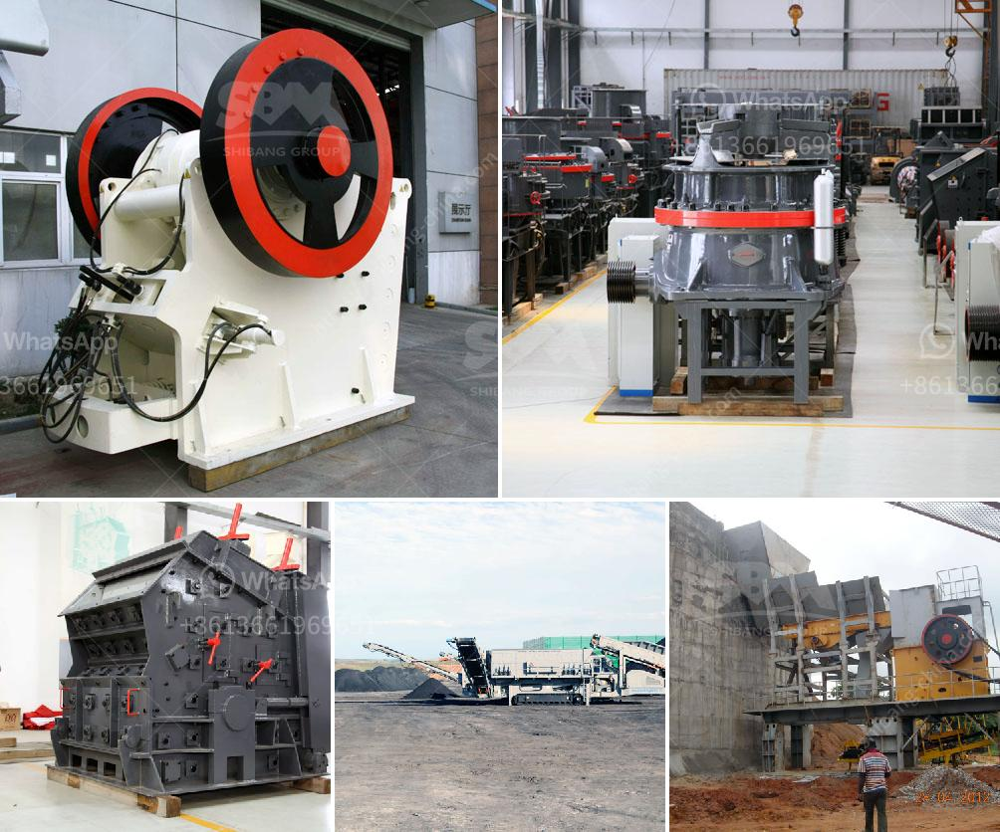

<h3>quote for cone crusher</h3>
Cone crushers are used in various industries, including mining and construction. One of the key components of this machine is the cone crusher quote, also known as the mantle. This quote plays a crucial role in the crushing process by breaking down the raw materials into smaller pieces.

The cone crusher quote is a concave-shaped mantle, which rotates eccentrically within the machine's crushing chamber. As the mantle gyrates, it crushes the raw materials against the concave walls, producing smaller rocks, gravel, or even dust. This process is essential for various applications, such as producing concrete aggregates or road base materials.

When considering a cone crusher quote, there are several factors to take into account. Firstly, the material composition of the quote will affect its durability and longevity. High-quality quotes are typically made from manganese steel due to its excellent wear resistance properties. Additionally, quotes can be further reinforced with various alloying elements to enhance their performance in specific applications.

Another critical factor when selecting a cone crusher quote is its design. Different manufacturers may offer varying designs, each optimized for different crushing purposes. For example, a quote with a steep angle will generate finer particles, while a flatter quote will produce coarser materials. Therefore, it's crucial to assess the specific requirements of your intended application when choosing the appropriate quote design.

Price is always a consideration when purchasing equipment, and cone crusher quotes are no exception. The cost of a quote can vary depending on its size, design, material composition, and manufacturer. It is important to compare prices from different suppliers to ensure you are getting the best value for your money. However, it is essential to keep in mind that the quality of the quote should not be compromised for cost, as a low-quality quote may lead to frequent replacement, downtime, and increased maintenance costs.

The cone crusher quote is a crucial component that should be regularly inspected and maintained to ensure optimal performance. Routine checks should include measuring the thickness of the quote to assess wear and determining if it needs to be replaced. It is recommended to follow the manufacturer's maintenance guidelines and consult experts when necessary.

In conclusion, cone crusher quotes are essential for the efficient crushing of raw materials in industries like mining and construction. When selecting a cone crusher quote, factors like material composition, design, and price should be taken into consideration. Regular maintenance and inspection of the quote are crucial to ensure its optimal performance and avoid unnecessary costs. Invest in the right cone crusher quote to enhance productivity and profitability in your operations.
<h3>Contact us</h3><ul><li><strong>Whatsapp:&nbsp;<a href="https://wa.me/8613661969651">+8613661969651</a></strong></li><li><a href="https://swt.shibang-china.com/?git&amp;zhl&amp;quote for cone crusher"><strong>Online Service(chat now)</strong></a></li></ul><h3>Related</h3><ul><li><a href='fairly used stone crusher for sale nigeria.md'>fairly used stone crusher for sale nigeria</a></li><li><a href='jaw crusher moby 600.md'>jaw crusher moby 600</a></li><li><a href='bentonite production plant machinery.md'>bentonite production plant machinery</a></li><li><a href='stone crusherproduction line.md'>stone crusherproduction line</a></li><li><a href='calcium carbonate plant contractors.md'>calcium carbonate plant contractors</a></li></ul>