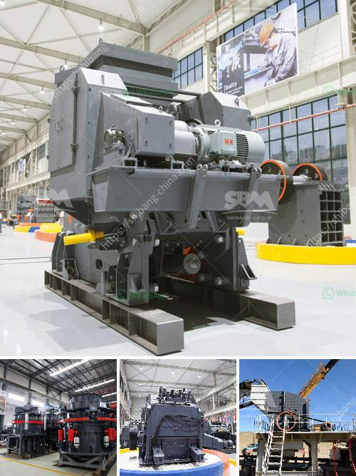

<h3>qurry crusher plant capacity</h3>
The quarry crusher plant is a crucial part of any quarry operation. It is used for crushing various materials such as limestone, granite, and basalt into smaller sizes that are suitable for further processing. It plays an important role in providing high-quality materials for construction projects, road building, and infrastructure development.

One of the key factors that determine the efficiency and productivity of a quarry crusher plant is its capacity. The capacity refers to the maximum amount of material that the crusher can process in a given time period. It is often measured in terms of the production rate, which is the quantity of material crushed per hour, day, or week.

A quarry crusher plant with a capacity between 300 and 500 tons per hour is quite popular among customers. The large feed opening, coupled with the hydraulic wedge adjustment system and manganese steel jaw plates, enable the crusher to handle even the biggest and toughest materials. This ensures high efficiency and productivity, as well as a low cost per ton of finished product.

The capacity of the quarry crusher plant is influenced by various factors. Firstly, it depends on the type and hardness of the material being crushed. Harder materials require more energy to crush, reducing the processing capacity. The size and distribution of the feed material also affect the capacity, as large chunks can cause blockages in the crusher. Furthermore, the speed and eccentricity of the crusher's main shaft can also impact the capacity.

Having a high-capacity quarry crusher plant offers numerous advantages. One of the most important benefits is the ability to meet the demands of large-scale construction projects and infrastructure development. Whether it is the construction of a new housing estate, a highway, or a railway line, a high-capacity crusher plant can provide the necessary quantity of crushed material in a timely manner.

In addition, a high-capacity quarry crusher plant can help reduce costs. By processing a greater amount of material per hour, the overall operation costs, such as fuel consumption and maintenance, can be minimized. This leads to a lower cost per ton of finished product, making the quarry more competitive in the market.

Moreover, a high-capacity crusher plant enables the quarry to increase its production rate and meet the growing demand for construction materials. This can result in higher revenues and profits for the quarry owners, creating a positive impact on the local economy.

In conclusion, the capacity of a quarry crusher plant is a critical factor in the efficient and productive operation of the quarry. A capacity between 300 and 500 tons per hour is often considered ideal for medium to large operations. High-capacity plants enable the production of large quantities of material, meeting the demands of construction projects and infrastructure development. They also help reduce costs, increase revenues, and create a positive impact on the local economy. It is therefore essential for quarry owners to invest in a high-capacity crusher plant to ensure long-term success and sustainability.
<h3>Contact us</h3><ul><li><strong>Whatsapp:&nbsp;<a href="https://wa.me/8613661969651">+8613661969651</a></strong></li><li><a href="https://swt.shibang-china.com/?git&amp;zhl&amp;qurry crusher plant capacity"><strong>Online Service(chat now)</strong></a></li></ul><h3>Related</h3><ul><li><a href='buy granite crusher.md'>buy granite crusher</a></li><li><a href='quartz powder manufacturing equipments.md'>quartz powder manufacturing equipments</a></li><li><a href='hard stone crush maker pakistan.md'>hard stone crush maker pakistan</a></li><li><a href='roll crushers for sale.md'>roll crushers for sale</a></li><li><a href='ultrafine grinding mill.md'>ultrafine grinding mill</a></li></ul>