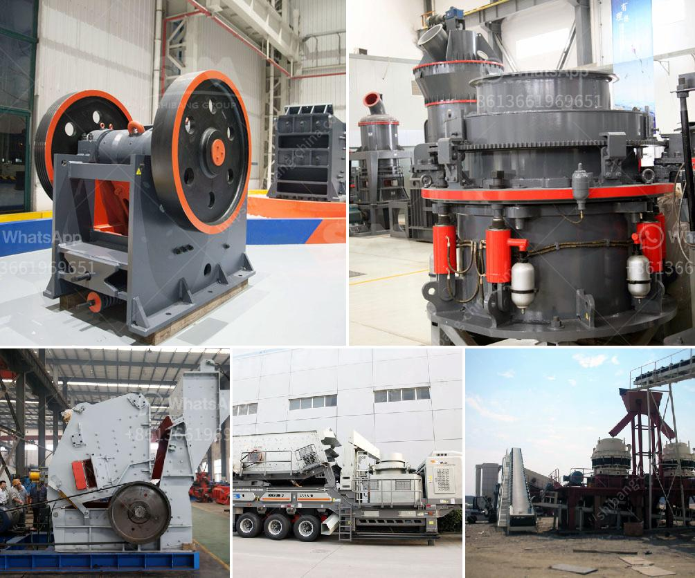

<h3>raymond grinding mill in pakistan</h3>
The development and advancement of technology in various industries has led to the emergence of innovative machinery and equipment that facilitates the production process. One such remarkable invention is the Raymond Grinding Mill, which is widely used to improve the grinding efficiency of various materials.

Raymond Grinding Mill, also known as R series pendulum mill, suits for grinding non-flammable and non-explosive materials with hardness less than 7, moisture content less than 6%, such as limestone, calcite, fly ash, calcium carbide, kaolin, calcium carbonate, coal gangue, gypsum, grain slag, ore slag, coal dust, bentonite, barite, marble, talc, refractory material, micro-powder, slag, refractory material, etc. With its excellent performance and practicality, the overwhelming demand for this grinding mill is palpable, especially in Pakistan.

Pakistan is known for having a vast array of natural resources, including minerals and ores, making it a central hub for various industrial activities. The mining sector in Pakistan is flourishing, thanks to the increasing demand for minerals both within the country and internationally. In such a scenario, the need for advanced grinding mills becomes imperative for efficient mineral processing.

The Raymond Grinding Mill has cemented its position as the industry standard for over a century. Its outstanding performance and unrivaled reliability make it the preferred choice for countless businesses in Pakistan. The mill operates on a simple yet efficient principle: the grinding roller swings outward, due to the centrifugal force generated by the rotation of the main shaft. As a result, the grinding roller and grinding ring shape a curved surface that enables efficient grinding.

The Raymond Grinding Mill boasts several key advantages that make it a top-notch product in the market. Firstly, its grinding efficiency is remarkable, surpassing traditional mills by a considerable margin. Its energy consumption is also lower compared to other grinding mills, reducing operational costs for businesses. Secondly, the mill is equipped with a high-quality classifier system that ensures a precise and uniform product size. This feature enables the mill to meet the desired particle size requirements of various industries, such as cement, chemicals, metallurgy, glass, mining, ceramics, and more.

Furthermore, the Raymond Grinding Mill is not only efficient but also versatile. It can handle various types of materials with different hardness levels, making it suitable for a wide range of applications. Additionally, the mill can be customized according to specific production needs. It is available in different sizes, enabling businesses to choose the most suitable option for their requirements.

The Raymond Grinding Mill has significantly contributed to the growth and development of various industries in Pakistan. Its technological advancements and unparalleled performance have transformed the grinding process, enhancing productivity and profitability for businesses. As a result, the demand for this mill continues to rise.

In conclusion, the Raymond Grinding Mill has revolutionized the grinding process in Pakistan. Its unbeatable performance and reliability have made it an indispensable tool for countless businesses in the mineral processing industry. With its exceptional features and versatility, the mill serves as a testament to technology advancement, facilitating efficient grinding operations and promoting growth in the economy.
<h3>Contact us</h3><ul><li><strong>Whatsapp:&nbsp;<a href="https://wa.me/8613661969651">+8613661969651</a></strong></li><li><a href="https://swt.shibang-china.com/?git&amp;zhl&amp;raymond grinding mill in pakistan"><strong>Online Service(chat now)</strong></a></li></ul><h3>Related</h3><ul><li><a href='hammer mill south africa.md'>hammer mill south africa</a></li><li><a href='100tph stone crushing and screening plant.md'>100tph stone crushing and screening plant</a></li><li><a href='rock crusher machine agent in malaysia.md'>rock crusher machine agent in malaysia</a></li><li><a href='top 5 brands of stone crushers.md'>top 5 brands of stone crushers</a></li><li><a href='rock quarry crusher machinery.md'>rock quarry crusher machinery</a></li></ul>