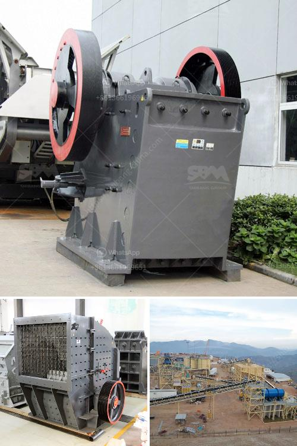

<h3>raymond mill crusher price</h3>
Raymond mill crushers are highly popular among enthusiasts and professionals in the mining industry for their efficiency in crushing various materials. This equipment is known for its high performance, reliability, and long lifespan. However, one crucial aspect that everyone considers is the price of these machines. In this article, we will delve into the factors that influence the price of Raymond mill crushers.

First and foremost, the brand plays a significant role in determining the price of these crushers. Established brands with a strong reputation tend to charge more for their products due to their reliability and trustworthiness. These brands have invested heavily in research and development, ensuring their machines are of the highest quality.

Next, the specifications and capacity of the Raymond mill crusher significantly impact its price. Different models and sizes of crushers come with varying prices. High-capacity crushers are suitable for heavy-duty operations and are priced accordingly. The more powerful the equipment, the higher the price is likely to be. Additionally, special features like advanced safety mechanisms or additional automation can increase the cost of the crusher.

Material quality is another crucial factor influencing the price of Raymond mill crushers. High-quality materials ensure the durability and longevity of the equipment. Components like steel frames, bearings, and motors made from top-grade materials tend to increase the overall cost. However, investing in superior quality materials can save costs in the long run by avoiding frequent maintenance and replacement expenses.

Maintenance and after-sales service are factors that also contribute to the price of a Raymond mill crusher. Machines that come with comprehensive after-sales service including technical support, warranty, and spare parts availability are usually priced higher. This is because such services guarantee peace of mind for the buyer, ensuring the equipment's optimal functioning.

Additionally, production costs, such as labor, machinery, and operational expenses, play a role in determining the price of Raymond mill crushers. Manufacturers need to consider all these costs to ensure they make a profit while remaining competitive in the market. Moreover, factors like demand and supply, exchange rates, and taxes imposed by different countries can also impact the final price of these crushers.

Lastly, geographical location can influence the price of a Raymond mill crusher. Manufacturers located in regions with higher labor costs or stricter environmental regulations may have to charge more to cover their expenses. Shipping costs can also vary depending on the distance between the manufacturer and the buyer, adding to the overall price of the crusher.

In conclusion, when it comes to the price of Raymond mill crushers, several factors come into play. The brand reputation, specifications, and capacity of the machine, material quality, maintenance, after-sales service, production costs, and geographical location all contribute to the final cost. It is crucial for buyers to consider these factors while also assessing their own needs and budget to make an informed decision when purchasing a Raymond mill crusher.
<h3>Contact us</h3><ul><li><strong>Whatsapp:&nbsp;<a href="https://wa.me/8613661969651">+8613661969651</a></strong></li><li><a href="https://swt.shibang-china.com/?git&amp;zhl&amp;raymond mill crusher price"><strong>Online Service(chat now)</strong></a></li></ul><h3>Related</h3><ul><li><a href='china talc processing factory.md'>china talc processing factory</a></li><li><a href='crusher repairs south africa.md'>crusher repairs south africa</a></li><li><a href='industrial ball mill.md'>industrial ball mill</a></li><li><a href='how to make industrial talcum powder.md'>how to make industrial talcum powder</a></li><li><a href='powder grinding mill machine equipment.md'>powder grinding mill machine equipment</a></li></ul>