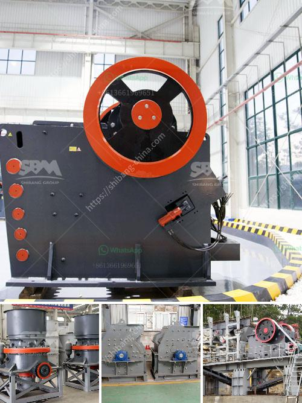

<h3>raymond mill from china best supplier on sale</h3>
In the world of mining, machinery plays a crucial role in smashing rocks, ores, and other solid materials into smaller, more manageable sizes. Among the plethora of machines available, the Raymond mill has emerged as one of the most efficient and reliable options. As the leading supplier of Raymond mills in China, our company takes pride in offering top-notch machinery that revolutionizes the mining industry.

What sets our Raymond mill apart from others? First and foremost, our mill has a unique design that ensures optimum performance and durability. The mill utilizes advanced technology to grind, pulverize, and classify a wide range of materials, including limestone, gypsum, marble, and dolomite, among others.

One of the standout features of our Raymond mill is its high efficiency. Thanks to its advanced grinding technology and large grinding surface, it can process materials quickly and efficiently, significantly reducing processing times. This enhanced productivity translates into improved profits for mining companies.

Moreover, our mill is equipped with a state-of-the-art dust removal system. This system effectively captures and eliminates harmful particles generated during the grinding process, ensuring a clean and safe working environment for operators. Additionally, the system minimizes the impact on the surrounding environment, making our mill an environmentally friendly choice.

Safety is always a top priority in the mining industry. Our Raymond mill is designed with numerous safety features to protect workers and prevent accidents. These include a soundproof and dustproof cabin, a user-friendly control panel, and emergency stop buttons. With these safety measures in place, operators can work with peace of mind, knowing that their well-being is prioritized.

Furthermore, the maintenance and servicing of our Raymond mill are simple and hassle-free. The design of the machine allows for easy access to internal components, making routine checks and repairs a breeze. This saves time and money, allowing mining companies to focus on their core operations.

As the best supplier of Raymond mills in China, our company is committed to providing superior products, unmatched customer service, and competitive pricing. Our extensive range of mills caters to the diverse needs of the mining industry, making us a one-stop destination for all milling requirements.

In conclusion, the Raymond mill from our China best supplier is a game-changer in the mining industry. Its revolutionary design, high efficiency, and safety features make it a must-have for any mining operation. Furthermore, its low maintenance requirements and environmentally friendly nature make it an economical and sustainable choice. Don't miss out on the opportunity to enhance your mining operations with our top-quality Raymond mill. Contact us today to learn more about our products and services.
<h3>Contact us</h3><ul><li><strong>Whatsapp:&nbsp;<a href="https://wa.me/8613661969651">+8613661969651</a></strong></li><li><a href="https://swt.shibang-china.com/?git&amp;zhl&amp;raymond mill from china best supplier on sale"><strong>Online Service(chat now)</strong></a></li></ul><h3>Related</h3><ul><li><a href='cement mill manufacturers in italy.md'>cement mill manufacturers in italy</a></li><li><a href='crushing and screening rustenburg.md'>crushing and screening rustenburg</a></li><li><a href='stone crusher mobile plant south africa.md'>stone crusher mobile plant south africa</a></li><li><a href='used stone crusher machine for sale in philippines.md'>used stone crusher machine for sale in philippines</a></li><li><a href='marble grinding mill.md'>marble grinding mill</a></li></ul>