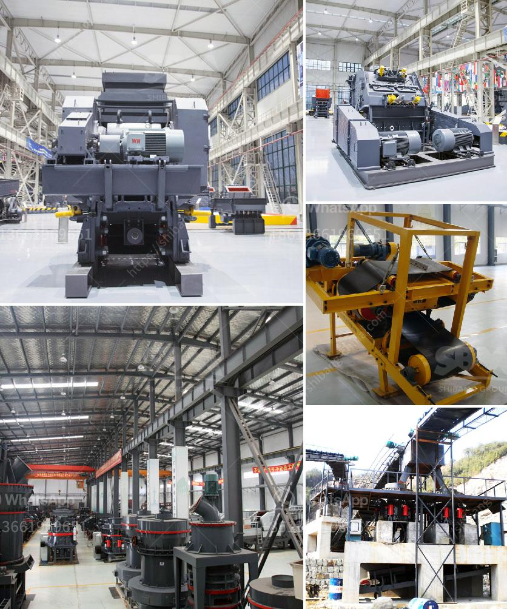

<h3>raymond mill in kenya</h3>
Raymond mill, also known as Raymond grinding mill, Raymond roller mill, and Raymond grinder, is suitable for grinding non-flammable and non-explosive materials whose Moh’s hardness is below 9.3 and humidity less than 6% such as barite, calcite, potassium feldspar, talc, marble, limestone, dolomite, fluorite and lime, activated clay, activated carbon, bentonite, kaolin, cement, phosphate rock, gypsum, glass, thermal insulation materials, etc. Its finished product size can be adjusted in the range of 50-325 mesh, which is suitable for various industrial applications.

In Kenya, the mining industry has been an important economic pillar for many years. With the continuous development of technology, the size and scope of the mining industry in Kenya have gradually expanded, making the grinding equipment such as Raymond mill more vital. This machine plays a significant role in the processing of various stone materials, offering great convenience for construction, material handling, mining, and other industries.

One of the key advantages of Raymond mill for stone processing in Kenya is its ability to grind materials finely. The granularity of the finished products can be adjusted within the range of 50-325 mesh, which significantly improves the degree of refinement of the materials. This feature is especially beneficial for customers who require high fineness for their products, such as those in the construction industry.

Moreover, Raymond mill in Kenya is characterized by high efficiency and productivity. Compared with traditional milling equipment, this machine can increase production by more than 40% and reduce unit power consumption by more than 30%. The advanced grinding roller and grinding ring design further improve the grinding efficiency and output, which greatly enhances its overall performance.

Additionally, Raymond mill is equipped with a centralized control system, which enables remote control and easy operation. The electrical system adopts a closed loop control to effectively ensure the fineness of the final product. The transmission device uses a sealed gearbox and pulleys, making the whole system more stable and reliable.

Another important advantage of Raymond mill in Kenya is its low noise and vibration levels. The unique design of the fan reduces noise and vibration, creating a relatively quiet working environment, which is beneficial for the health of operators and surrounding residents. This feature distinguishes Raymond mill from other similar machines, making it an optimal choice for customers in Kenya.

In conclusion, Raymond mill is a specialized machine that is widely used in Kenya for stone processing. This machine has brought great benefits to the mining industry in Kenya, promoting technological innovation and progress in the country. With its outstanding performance and reliable operation, Raymond mill is becoming more and more popular among Kenyan customers.
<h3>Contact us</h3><ul><li><strong>Whatsapp:&nbsp;<a href="https://wa.me/8613661969651">+8613661969651</a></strong></li><li><a href="https://swt.shibang-china.com/?git&amp;zhl&amp;raymond mill in kenya"><strong>Online Service(chat now)</strong></a></li></ul><h3>Related</h3><ul><li><a href='kaolin separate beneficiation of iron.md'>kaolin separate beneficiation of iron</a></li><li><a href='feldspar powder morbi.md'>feldspar powder morbi</a></li><li><a href='canadian gold mining equipment manufacturers.md'>canadian gold mining equipment manufacturers</a></li><li><a href='blands of quarry crusher plant ball mill.md'>blands of quarry crusher plant ball mill</a></li><li><a href='stone crushers for sale in south africa.md'>stone crushers for sale in south africa</a></li></ul>