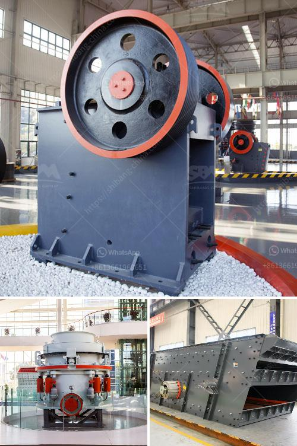

<h3>raymond mill manufacturer in india</h3>
Raymond mill is common milling equipment, mainly used for barite, calcite, feldspar, talc, marble, limestone, dolomite, fluorite, lime, activated clay, and others. It is widely used in mineral processing, building materials and chemical industry. As a professional Raymond mill manufacturer in India, Clirik experts have years of experience in the mining industry and can offer professional solutions for milling needs.

Raymond mill is a traditional mill type, which is suitable for the grinding of minerals such as barite, calcite, potassium feldspar, talc, marble, limestone, dolomite, fluorite, lime, activated clay, activated carbon, bentonite, kaolin, cement, phosphate rock, gypsum, glass, insulation materials, etc. With the increasing market demand for fine powder products, Raymond mills have become the mainstream equipment in the milling industry.

Clirik is a leading machinery and equipment manufacturer in China, providing a wide range of grinding equipment for various industries. Among them, Raymond mill is one of the star products of Clirik. Compared with other grinding equipment, Raymond mill has a high screening rate, low failure rate, and low operating cost. It has been favored by the majority of users.

Raymond mill manufacturers in India differ in many aspects. With various manufacturers and the prices of Raymond mill in India varying greatly, Clirik is committed to providing high-quality mill equipment and professional solutions for grinding customers.

Raymond mill is widely used in metallurgy, building materials, chemical industry, mining and other fields of mineral materials in grinding processing. Clirik's high-quality equipment meets the requirements of customers for high-efficiency and low-consumption grinding processing, and is a solid foundation for the development of Raymond mill in India.

Clirik has highly reliable and experienced after-sales team, providing 24/7 online service, professional technical guidance, and customized solutions. When purchasing Raymond mill equipment, customers can obtain professional guidance and support, which greatly reduces the time and effort for maintenance and troubleshooting.

In addition to Raymond mill, Clirik also provides a complete set of powder production line solutions, including grinding equipment, powder packing machine, powder conveying equipment, and powder storage solutions. The one-stop service can meet the diverse needs of customers and enhance the production efficiency of powder processing plants.

With the continuous development and innovation of Raymond mill, Clirik will continue to optimize the equipment and provide more efficient, energy-saving, and environmentally friendly Raymond mill products for users in India and around the world. As a professional Raymond mill manufacturer, Clirik is committed to providing high-quality mill equipment, competitive prices, and comprehensive after-sales service. Choose Clirik, choose reliable and efficient grinding equipment!

To sum up, as a professional Raymond mill manufacturer in India, Clirik has a wide range of models, sizes, and colors. The price of Raymond mills varies greatly, depending on the model selected. Clirik's Raymond mills are highly efficient and energy-saving, with excellent quality and performance. Therefore, Clirik is the best choice for Raymond mill manufacturing in India.
<h3>Contact us</h3><ul><li><strong>Whatsapp:&nbsp;<a href="https://wa.me/8613661969651">+8613661969651</a></strong></li><li><a href="https://swt.shibang-china.com/?git&amp;zhl&amp;raymond mill manufacturer in india"><strong>Online Service(chat now)</strong></a></li></ul><h3>Related</h3><ul><li><a href='prices for stone gold mills in south africa.md'>prices for stone gold mills in south africa</a></li><li><a href='crusher price in kazakhstan.md'>crusher price in kazakhstan</a></li><li><a href='price for china crusher.md'>price for china crusher</a></li><li><a href='mobile crusher di malaysia.md'>mobile crusher di malaysia</a></li><li><a href='impact crusher sale.md'>impact crusher sale</a></li></ul>