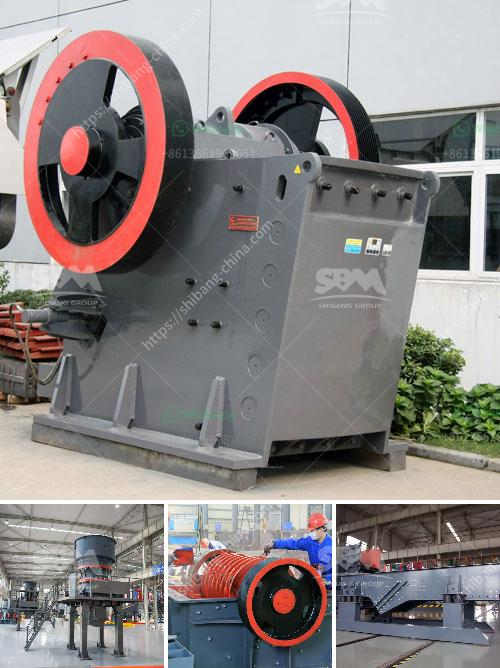

<h3>raymond mill manufacturers in</h3>
The Raymond Mill industry is one of the prominent and booming industries in the world economy. With the ever-increasing demand for various products in different industries, Raymond Mill manufacturers are making continuous efforts to provide advanced milling equipment that meets the needs of various industries. In this article, we will explore the world of Raymond Mill manufacturers and the factors contributing to their success.

Raymond Mill is a highly versatile and widely used milling machine that helps industries reduce their operational costs. Raymond Mill manufacturers serve industries such as mining, chemicals, construction, and metallurgy, among others. Raymond Mill machines are known for their high performance, high efficiency, and lower maintenance costs.

One of the leading Raymond Mill manufacturers in the industry is Shanghai Clirik Machinery Co., Ltd. With a dedicated team and state-of-the-art technology, this manufacturer offers a wide range of Raymond Mill equipment suitable for various applications. They provide Raymond Mill machines that grind materials with Mohs hardness below 7 and humidity below 6%, ensuring that the final product meets the desired fineness level.

Shanghai Clirik Machinery Co., Ltd. has established itself as a reliable and reputable Raymond Mill manufacturer due to its commitment to quality. Their machines are made using high-quality materials and advanced manufacturing techniques. This ensures that the equipment is durable and can withstand heavy-duty operations in different industries.

Another notable Raymond Mill manufacturer is Guilin Hongcheng Mining Equipment Manufacture Co., Ltd. known for its comprehensive range of milling machines. This manufacturer offers Raymond Mill machines with different specifications and sizes, catering to the diverse requirements of industries. Their Raymond Mill equipment is highly efficient, which leads to increased productivity and reduced energy consumption.

Guilin Hongcheng Mining Equipment Manufacture Co., Ltd. prioritizes customer satisfaction and product quality. They have a dedicated team of engineers who focus on continuous research and development to ensure that their Raymond Mill machines are technologically advanced. By integrating cutting-edge technology into their machines, they push the boundaries of what Raymond Mill equipment can achieve.

The Raymond Mill industry is witnessing rapid growth, driven by various factors. One such factor is the increasing demand for high-quality products in industries like construction and mining. Raymond Mill manufacturers are capitalizing on this demand by providing advanced milling machines that can process a wide range of materials, including limestone, gypsum, coal, and many more.

The focus on sustainability and eco-friendly practices is also driving the growth of the Raymond Mill industry. Manufacturers are taking steps to reduce their carbon footprint by implementing energy-efficient technologies in their Raymond Mill machines. This not only benefits the environment but also helps industries reduce their operating costs.

In conclusion, the Raymond Mill industry is thriving due to the continuous efforts of manufacturers to provide advanced milling equipment. Companies like Shanghai Clirik Machinery Co., Ltd. and Guilin Hongcheng Mining Equipment Manufacture Co., Ltd. are leading the way by offering high-performance, efficient, and reliable Raymond Mill machines. As industries continue to expand, Raymond Mill manufacturers will play a crucial role in meeting their milling needs and contributing to their success.
<h3>Contact us</h3><ul><li><strong>Whatsapp:&nbsp;<a href="https://wa.me/8613661969651">+8613661969651</a></strong></li><li><a href="https://swt.shibang-china.com/?git&amp;zhl&amp;raymond mill manufacturers in"><strong>Online Service(chat now)</strong></a></li></ul><h3>Related</h3><ul><li><a href='small gold mining plant in south africa.md'>small gold mining plant in south africa</a></li><li><a href='slag crusher plant.md'>slag crusher plant</a></li><li><a href='china cone crusher.md'>china cone crusher</a></li><li><a href='crusher machine factory in gujranwala pakistan.md'>crusher machine factory in gujranwala pakistan</a></li><li><a href='qurry crusher plant capacity.md'>qurry crusher plant capacity</a></li></ul>