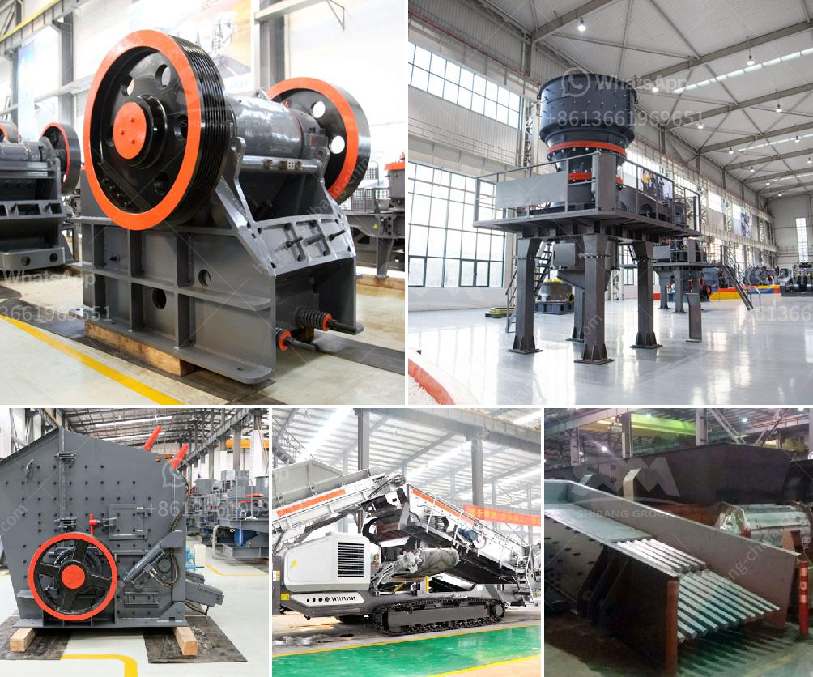

<h3>raymond mill plant</h3>
In today's competitive market, every industry wants to maximize its operating efficiency and output. One key factor that affects both these aspects is the quality of grinding equipment used. Among the various options available, Raymond Mill Plant has become increasingly popular due to its unparalleled advantages.

Raymond Mill Plant is a state-of-the-art milling equipment that is capable of producing a wide range of powders with a fineness ranging from 50 mesh to 325 mesh. This machine guarantees a constant output with consistent particle size distribution, making it an ideal choice for various applications such as limestone, gypsum, coal, calcium carbonate, and many more.

The Raymond mill operates on the principle of pendulum grinding, which results in a higher level of production compared to traditional ball mills. With its innovative design, the mill uses rolling compression to grind materials, thereby reducing the energy consumption and increasing the production capacity. This ensures that the Raymond Mill Plant provides a cost-effective solution for grinding needs.

Another significant advantage of the Raymond Mill Plant is its low operation and maintenance cost. The plant is equipped with advanced technology, including a high-precision analyzer and an automatic control system that facilitates easy operation and monitoring. This reduces the need for manual intervention, saving time and effort. Moreover, the plant is designed with robust construction, ensuring its durability and longevity.

The Raymond Mill Plant is also known for its environmental friendliness. With its advanced dust removal system, the plant ensures minimal dust and noise pollution. This not only contributes to a healthier working environment but also complies with environmental regulations. Furthermore, the plant's energy-efficient design helps in reducing greenhouse gas emissions, making it a sustainable choice for industries striving to adopt eco-friendly practices.

When it comes to customer satisfaction, the Raymond Mill Plant stands out from its competitors. The machine is backed by a team of dedicated professionals who provide excellent after-sales service, ensuring smooth operations and minimizing downtime. With their expertise, they help clients optimize the performance of the mill, enabling them to achieve their production goals efficiently.

In conclusion, the Raymond Mill Plant is a versatile and cost-effective solution for grinding needs in various industries. Its superior efficiency, low maintenance cost, and environmental friendliness make it a preferred choice among customers. With its ability to deliver consistent, high-quality output, this advanced milling equipment is revolutionizing the way industries approach grinding processes. Whether it is industrial minerals, chemical powders, or other materials, the Raymond Mill Plant provides the perfect platform for achieving excellent results.
<h3>Contact us</h3><ul><li><strong>Whatsapp:&nbsp;<a href="https://wa.me/8613661969651">+8613661969651</a></strong></li><li><a href="https://swt.shibang-china.com/?git&amp;zhl&amp;raymond mill plant"><strong>Online Service(chat now)</strong></a></li></ul><h3>Related</h3><ul><li><a href='limestone crusher philippines.md'>limestone crusher philippines</a></li><li><a href='cost of complete stone crushing plant in ghana.md'>cost of complete stone crushing plant in ghana</a></li><li><a href='calculation coal crusher.md'>calculation coal crusher</a></li><li><a href='ball mill in romania.md'>ball mill in romania</a></li><li><a href='price for sand machine.md'>price for sand machine</a></li></ul>