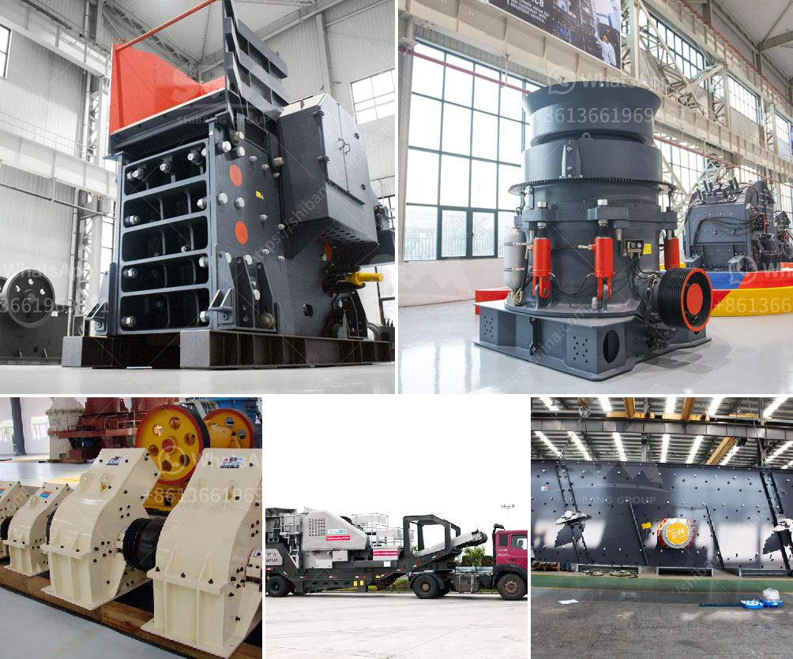

<h3>rental companies of mobile crusher</h3>
Rental companies of mobile crushers are constantly striving to provide high-quality equipment to their customers to enhance their overall productivity. The rental industry is witnessing a boom in recent years due to the increasing demand for crushers from various sectors such as mining, construction, and infrastructure.

One of the key factors driving the rental market is the flexibility it offers to customers. Instead of investing a huge amount in purchasing a crusher, companies can simply rent one for a specific period. This not only reduces their upfront costs but also eliminates the need for maintenance and storage, making it a cost-effective solution.

Rental companies have a wide range of crushers available, catering to different requirements of their customers. These crushers are equipped with the latest technology to ensure efficient crushing operations. Whether it is a jaw crusher, cone crusher, or impact crusher, rental companies have it all, enabling customers to choose the right equipment based on their project needs.

Moreover, rental companies understand that downtime can have a significant impact on their customers' operations. Hence, they ensure that their crushers are regularly serviced and maintained to minimize any potential breakdowns or performance issues. This ensures that customers can rely on the rental equipment to deliver consistent results without any interruptions.

In addition to high-quality equipment, rental companies also provide necessary accessories and support services to their customers. They offer trained operators who can handle the crushers efficiently, saving customers both time and effort. Furthermore, rental companies provide timely delivery and pick-up of the equipment, ensuring a hassle-free experience for their customers.

Overall, rental companies of mobile crushers play a crucial role in fulfilling the crushing requirements of various industries. With their extensive range of equipment, flexibility, and reliable support services, these companies empower their customers to complete their projects efficiently and successfully. As the rental market continues to grow, it is expected that more companies will opt for the rental option, further fueling the demand for mobile crushers.
<h3>Contact us</h3><ul><li><strong>Whatsapp:&nbsp;<a href="https://wa.me/8613661969651">+8613661969651</a></strong></li><li><a href="https://swt.shibang-china.com/?git&amp;zhl&amp;rental companies of mobile crusher"><strong>Online Service(chat now)</strong></a></li></ul><h3>Related</h3><ul><li><a href='stone crusher machine in peru.md'>stone crusher machine in peru</a></li><li><a href='coal washing plant for sale grinding mill china.md'>coal washing plant for sale grinding mill china</a></li><li><a href='cement plant in turkey.md'>cement plant in turkey</a></li><li><a href='feldspar powder morbi.md'>feldspar powder morbi</a></li><li><a href='sand and gravel separation machine.md'>sand and gravel separation machine</a></li></ul>