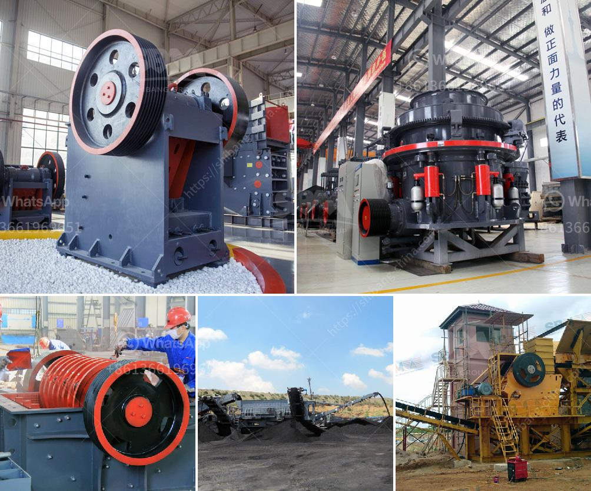

<h3>rental mobile stone crusher machine in malaysia</h3>
Malaysia is known for its rich heritage in art and culture, with a diverse history that encompasses influences from Malay, Chinese, and Indian civilizations. This vibrant mix of cultures has resulted in a unique blend of architectural styles and a melting pot of delicious cuisines. However, the modernization of Malaysia has also given rise to a need for efficient construction machinery, including rental mobile stone crusher machines.

Stone crushers are essential units in the construction industry, as they produce the necessary aggregates required for creating buildings, roads, and bridges. These aggregates are vital for various construction projects, as they serve as a foundation for the infrastructure. However, purchasing a stone crusher machine is an expensive investment and not everyone has the financial capacity to own one.

This is where rental mobile stone crusher machines come into play. The stone crusher machines are temporarily rented to those who need them, greatly reducing the cost of investment. In addition, rental mobile stone crushers are not only ideal for construction sites but also for crushing lumps of rock ore during mining operations.

Utilizing rental mobile stone crushers in Malaysia can be extremely beneficial for both contractors and individuals. Renting versus buying can provide significant cost savings and flexibility. Renting offers a fast and convenient solution for construction professionals who need equipment only for a specific project or limited period. On the other hand, individuals can also benefit from renting these machines for their private property projects without committing to a long-term purchase.

To meet the growing demand, an increasing number of companies in Malaysia have started offering rental services for mobile stone crushers. These companies provide excellent customer service, top-notch equipment, and affordable rental plans to cater to different construction needs.

In conclusion, rental mobile stone crusher machines are necessary for construction sites and mining operations. Utilizing these machines can significantly reduce the cost of investment and provide flexibility for contractors and individuals with short-term construction projects. With the increasing availability of rental services in Malaysia, finding the right equipment for crushing tasks has become easily accessible for everyone.
<h3>Contact us</h3><ul><li><strong>Whatsapp:&nbsp;<a href="https://wa.me/8613661969651">+8613661969651</a></strong></li><li><a href="https://swt.shibang-china.com/?git&amp;zhl&amp;rental mobile stone crusher machine in malaysia"><strong>Online Service(chat now)</strong></a></li></ul><h3>Related</h3><ul><li><a href='screen mobile crusher.md'>screen mobile crusher</a></li><li><a href='wet process feldspar supplier.md'>wet process feldspar supplier</a></li><li><a href='granite stone processing plant.md'>granite stone processing plant</a></li><li><a href='dry processing machine supplier.md'>dry processing machine supplier</a></li><li><a href='iron slag buyers in punjab india.md'>iron slag buyers in punjab india</a></li></ul>