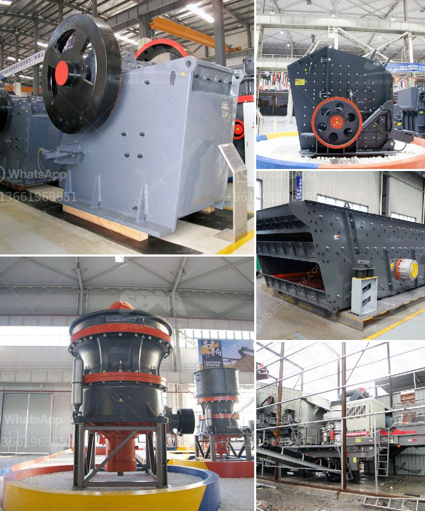

<h3>river rock crushing equipment</h3>
River rock is a type of gravel that consists of small, rounded stones and is often used as a decorative addition to landscaping or as a base material for walkways and driveways. Crushing river rock can be a challenging task, as rocks that are too large won't go through the crushing machine and may cause damage, while rocks that are too small can result in a reduced quality of the final product. That's why it is important to have the right equipment to effectively crush river rocks.

One of the most commonly used machines for crushing river rock is a jaw crusher. This machine uses a compressive force to break the rock into smaller pieces, reducing it to the desired size. Jaw crushers are known for their reliability and high performance, making them ideal for crushing river rock.

Another popular option for crushing river rock is a cone crusher. Cone crushers are similar to jaw crushers in their operation, with a cone-shaped crushing chamber and an eccentrically rotating mantle. These machines are often used in secondary or tertiary crushing applications, as they can produce fine and consistent products.

For larger river rocks, a gyratory crusher may be the best choice. Gyratory crushers are designed to handle extremely hard materials and can be used for primary crushing of large river rocks. These machines operate by compressing the material between an eccentrically rotating main shaft and a fixed concave surface.

In addition to these primary crushers, there are also impact crushers and hammer mills that can be used for crushing river rock. Impact crushers work by throwing the rock against a rigid surface, such as a steel plate, and breaking it into smaller fragments. Hammer mills, on the other hand, use hammers attached to a spinning rotor to crush the rock.

In conclusion, having the right equipment is crucial when it comes to crushing river rock effectively. Whether it is a jaw crusher, cone crusher, gyratory crusher, impact crusher, or hammer mill, selecting the right machine for the job will result in high-quality crushed rock that meets your project requirements.
<h3>Contact us</h3><ul><li><strong>Whatsapp:&nbsp;<a href="https://wa.me/8613661969651">+8613661969651</a></strong></li><li><a href="https://swt.shibang-china.com/?git&amp;zhl&amp;river rock crushing equipment"><strong>Online Service(chat now)</strong></a></li></ul><h3>Related</h3><ul><li><a href='hammer mills used in kenya.md'>hammer mills used in kenya</a></li><li><a href='vertical mill size.md'>vertical mill size</a></li><li><a href='mobile cone crusher zenith.md'>mobile cone crusher zenith</a></li><li><a href='mobile crusher indonesia.md'>mobile crusher indonesia</a></li><li><a href='pe 500 750 jaw crusher price.md'>pe 500 750 jaw crusher price</a></li></ul>