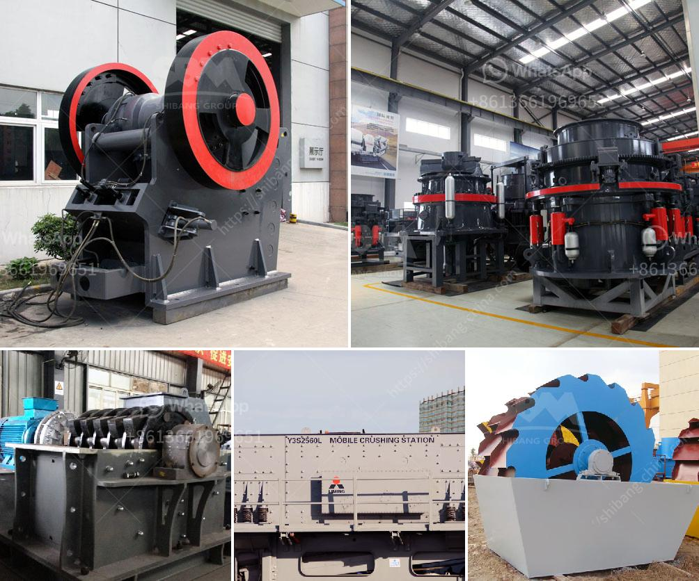

<h3>river stone crusher</h3>
River stone is a natural stone with abundant resources. In recent years, with the rapid development of construction industry, the demand of sand is increasing sharply. In order to meet the market demand, machinery manufacturers have launched varieties of river stone crushers with different specifications and configurations to meet the needs of users.

The river stone crusher produced by our company is mainly used to crush hard and medium hard stones in stone mining, metallurgy industry, building material, highway, railway, chemical industry, water conservancy project, communications, mining and quarry and road paving etc. The crushed river stone is widely used as aggregate in construction industry.

This site is located in Almaty, Kazakhstan. According to customer's requirements, we recommend Y3S1860CS160 mobile crushing plant as the important role in the production line. Its capacity is around 150t/h, which makes customer satisfied.

Compared with the traditional mobile crushing plant, the mobile crushing plant adopts the self-driving mode, advanced technology and complete functions. Mobile crushing plant can crush large river stone into smaller size. Users can take different configuration according to specific needs. It can be divided into standard type, closed-circuit type and multiple combinations of combination type.

The production cost investment of the mobile stone crushing plant is low. It saves time for stationing at the construction site quickly. It is also easier to station in the reasonable construction area, and it provides more flexible space and reasonable layout configuration for overall crushing process.

The mobile river stone crusher plant with tire configuration is the production line crushes river stones, which is convenient for mobile use. It can be directly driven into the work site, and the sand and gravel aggregate can reach the construction site more smoothly and efficiently.

The river stone crusher has a powerful crushing capacity, which can easily crush dense and large river stones and provide high-quality sand and gravel aggregate for engineering projects.

The river stone crusher is equipped with advanced manufacturing technology and technical tools. The wearing parts consist of wear-resistant materials, carbon steel and alloy steel. Its high crushing efficiency, small crusher power and high output have more advantages than similar products.

In conclusion, the river stone crusher machine works by using high-speed rotating wheel, which can crush the stones into small pieces in order to make them further be sand or ground for construction and other purposes. There are various types of river stone crushers including jaw crusher, impact crusher, cone crusher, sand making machine, etc.

The river stone crusher is manufactured with high-quality materials and advanced technology. It consists of the main frame, rotor, transmission device, disc, risers, and hammers, which makes it more convenient to replace parts and conduct maintenance.

The river stone crusher has proven to be an essential tool in modern construction projects as it produces concrete aggregate, road fill, and other materials that are used in construction projects. It plays a crucial role in the development of infrastructures around the world.
<h3>Contact us</h3><ul><li><strong>Whatsapp:&nbsp;<a href="https://wa.me/8613661969651">+8613661969651</a></strong></li><li><a href="https://swt.shibang-china.com/?git&amp;zhl&amp;river stone crusher"><strong>Online Service(chat now)</strong></a></li></ul><h3>Related</h3><ul><li><a href='limestone grinding roller mill.md'>limestone grinding roller mill</a></li><li><a href='metals alloys for ball mill.md'>metals alloys for ball mill</a></li><li><a href='coal pulverisers machines.md'>coal pulverisers machines</a></li><li><a href='gypsum recycling machines for sale.md'>gypsum recycling machines for sale</a></li><li><a href='machines use for mining sand from river.md'>machines use for mining sand from river</a></li></ul>