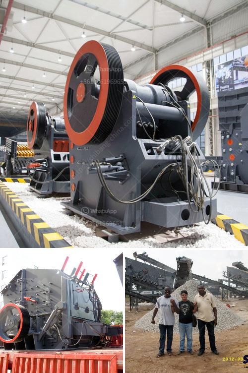

<h3>rock and gravel crushers used</h3>
Rock and gravel crushers are essential tools in mining, construction, road-building, and recycling applications. These machines break down the material into smaller sizes for further processing or for end use. Different types of crushers are available in the market to cater to specific needs.

One of the most common types of crushing machines is a jaw crusher. It consists of a fixed jaw and a movable jaw, with an opening between them. The material is fed into the chamber and crushed between the jaws as they come together. Jaw crushers are ideal for primary crushing because they can handle large pieces of rock or gravel.

Another popular option is a cone crusher. This machine has a similar principle to the jaw crusher, but it operates by squeezing the material between an eccentrically rotating cone and a fixed outer mantle. Cone crushers are commonly used for secondary or tertiary crushing, where the final product size is desired to be uniform and of a specific shape.

Impact crushers, also known as hammer mills, use the principle of quick impacts to crush the material. They deliver high rotational speeds, which cause the material to be thrown against the plates or anvils. This action breaks the rock or gravel into smaller fragments. These crushers are suitable for recycling applications because they can process various types of materials, including asphalt and concrete.

When choosing a rock or gravel crusher, it is essential to consider the desired output size and capacity requirements. Some crushers offer adjustable settings to control the final product size. Additionally, the hardness and abrasiveness of the material should be taken into account, as it affects the choice of crushers and the wear on the machine.

Maintenance is crucial to ensure optimal operation and a long lifespan of the crusher. Regular inspections, lubrication, and replacement of worn parts are essential. Proper training and safety precautions should be provided to operators to avoid accidents and injuries.

In conclusion, rock and gravel crushers play a vital role in various industries, enabling the efficient processing of raw materials. These crushers come in different types, such as jaw crushers, cone crushers, and impact crushers, each suitable for specific applications. Choosing the right crusher and maintaining it properly are key factors in ensuring productive and reliable crushing operations.
<h3>Contact us</h3><ul><li><strong>Whatsapp:&nbsp;<a href="https://wa.me/8613661969651">+8613661969651</a></strong></li><li><a href="https://swt.shibang-china.com/?git&amp;zhl&amp;rock and gravel crushers used"><strong>Online Service(chat now)</strong></a></li></ul><h3>Related</h3><ul><li><a href='small stone crushers.md'>small stone crushers</a></li><li><a href='crusher for dolomite.md'>crusher for dolomite</a></li><li><a href='vertical grinding machine.md'>vertical grinding machine</a></li><li><a href='used crusher price in uk.md'>used crusher price in uk</a></li><li><a href='medium ballast making machine.md'>medium ballast making machine</a></li></ul>