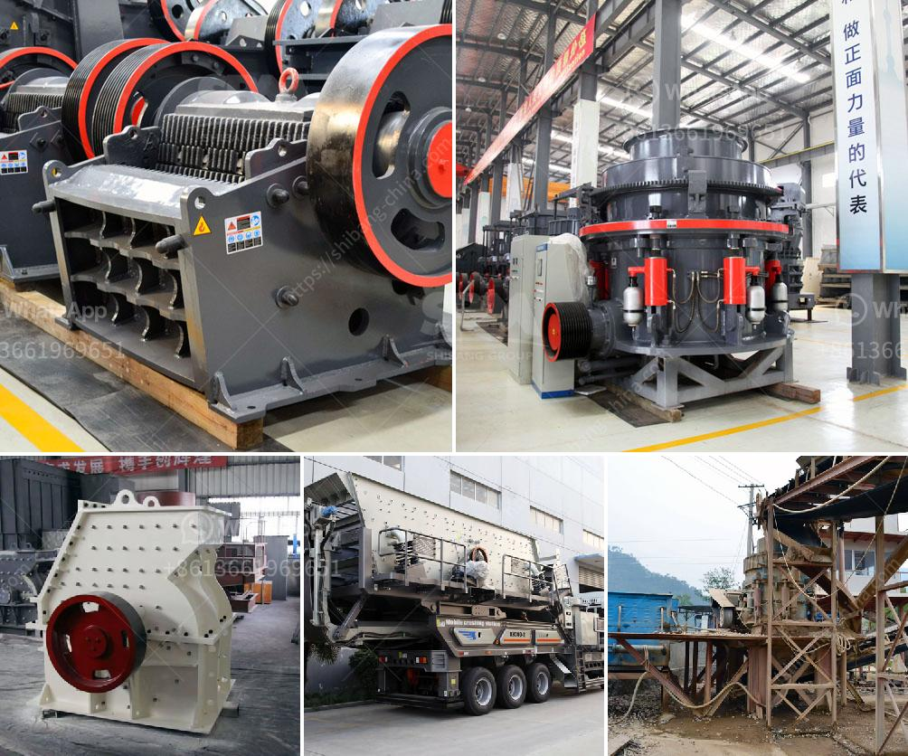

<h3>rock crusher equipment</h3>
Rock crushing equipment plays a crucial role in many industrial and mining processes. When the rock material is fed into the crusher, the result is processed into smaller particles, which can then be used in various applications or further processed to add value. Rock crushers are typically used in quarries, mining operations, demolition, and recycling applications.

The primary purpose of a rock crusher equipment is to reduce the size of raw material and process it into smaller, more manageable particles. Crushers achieve this by breaking down larger rocks into smaller, consistent sizes. Different types of crushers are designed to handle different types of rocks and stones.

One of the most common types of rock crushers is the jaw crusher. It is used primarily for primary crushing of materials. The jaws of the crusher are designed to withstand high pressure and are made from durable materials such as cast iron or steel. The jaw crusher uses mechanical pressure to compress the material against the stationary jaw plate, making it easy to break down larger rocks into smaller particles.

Another popular type of rock crusher equipment is the cone crusher. This type of crusher is used to crush rocks and ores for secondary crushing. The cone crusher has a rotating shaft that runs vertically, and an eccentrically gyrating mantle. As the rock enters the crusher, it is crushed between the mantle and the bowl liner, reducing the size of the rock particles.

In addition to jaw and cone crushers, there are also impact crushers, which are used to crush rocks and ores by means of high-speed impact. These crushers are capable of producing a wide range of sizes, from very fine to coarse particles. Impact crushers use a combination of impact force and compression to break down the rock material. They are commonly used in the mining and construction industries.

Rock crusher equipment is designed to be easy to use and maintain. It comes with adjustable settings to ensure that the desired size of the crushed rock can be achieved. Most rock crushers have a hopper at the top where the raw materials are fed into the crusher and a rotating chamber where the rock material is crushed.

Rock crushing equipment has many benefits in various industrial and mining processes. By reducing the size of the raw materials, it makes it easier to transport and handle. Smaller particles are also easier to process and can be used in a variety of applications such as construction, road building, and concrete production.

Furthermore, using rock crushers in recycling processes helps reduce waste and conserve natural resources. Instead of disposing of rocks and stones, they can be crushed and reused in various construction projects. This not only saves money but also reduces the need for new raw materials.

Overall, rock crusher equipment plays a vital role in many industries by helping to process raw materials and reduce waste. With its ability to break down large rocks into smaller particles, it enables easier transportation, handling, and recycling. Whether it is for mining, construction, or recycling purposes, rock crushers are an essential part of the industrial process.
<h3>Contact us</h3><ul><li><strong>Whatsapp:&nbsp;<a href="https://wa.me/8613661969651">+8613661969651</a></strong></li><li><a href="https://swt.shibang-china.com/?git&amp;zhl&amp;rock crusher equipment"><strong>Online Service(chat now)</strong></a></li></ul><h3>Related</h3><ul><li><a href='wet grinding of mica process and equipment.md'>wet grinding of mica process and equipment</a></li><li><a href='builders conveyor south africa.md'>builders conveyor south africa</a></li><li><a href='jaw crusher 24x36.md'>jaw crusher 24x36</a></li><li><a href='were to buy old rock crusher.md'>were to buy old rock crusher</a></li><li><a href='mini stone crusher price in south africa.md'>mini stone crusher price in south africa</a></li></ul>